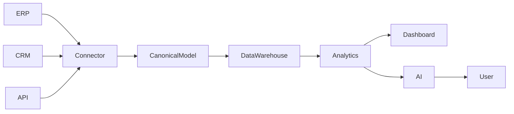

# Enterprise Intelligence Platform (EIP)

> **One Platform. Every Business Insight.**

Enterprise Intelligence Platform (EIP) é uma plataforma SaaS de Inteligência Corporativa desenvolvida para conectar, transformar e analisar dados empresariais de forma unificada.

O objetivo da plataforma é centralizar informações provenientes de diferentes sistemas, disponibilizar análises em tempo real, inteligência artificial, automações e ferramentas de apoio à decisão para empresas de qualquer porte.

---

# Visão

A EIP não foi concebida apenas como uma ferramenta de Business Intelligence.

Ela foi projetada para ser a camada de inteligência corporativa das organizações.

Enquanto ERPs executam processos operacionais, a EIP conecta essas informações, padroniza os dados, aplica Inteligência Artificial e entrega conhecimento para apoiar decisões estratégicas.

---

# Objetivos

- Conectar qualquer ERP ou sistema através de APIs.
- Padronizar dados em um Modelo Canônico.
- Disponibilizar dashboards modernos e interativos.
- Incorporar Inteligência Artificial Conversacional.
- Automatizar processos corporativos.
- Fornecer uma plataforma SaaS escalável.
- Permitir expansão através de conectores e marketplace.

---

# Principais Características

- API First
- Cloud Native
- Multi-Tenant
- Multiempresa
- Multi-ERP
- Multi Banco de Dados
- IA First
- Arquitetura Modular
- Escalabilidade Horizontal
- Event-Driven
- Segurança por Design

---

# Arquitetura de Alto Nível

```text
                    Frontend (Angular)

                           │

                      API Gateway

                           │

 ┌──────────────────────────────────────────────┐

 Identity Service

 Analytics Service

 Dashboard Service

 Connector Service

 AI Service

 Automation Service

 Notification Service

 Billing Service

 Scheduler Service

 Audit Service

 └──────────────────────────────────────────────┘

          │

   Redis • RabbitMQ

          │

 SQL Server • Data Warehouse

          │

 Object Storage

          │

 ERP • CRM • APIs • Bancos • Arquivos
```

---

# Stack Tecnológica

## Frontend

- Angular
- TypeScript
- Tailwind CSS
- Angular Material
- Apache ECharts
- RxJS

## Backend

- ASP.NET Core
- C#
- Entity Framework Core
- Dapper
- MediatR
- FluentValidation

## Banco de Dados

- SQL Server
- Data Warehouse

## Cache

- Redis

## Mensageria

- RabbitMQ

## Infraestrutura

- Docker
- Kubernetes
- NGINX

## Observabilidade

- Grafana
- Prometheus
- OpenTelemetry
- Serilog

---

# Modelo Conceitual



---

# Connector Framework

A plataforma utiliza uma arquitetura baseada em conectores.

Cada sistema externo é integrado por um conector responsável por extrair os dados e preservar sua linhagem no Data Lake. O Pipeline Canônico realiza a validação e a transformação para o Modelo Canônico interno.

Conectores previstos:

- ERP Protheus
- SAP
- Sankhya
- Omie
- Senior
- Oracle
- Microsoft Dynamics
- Odoo
- APIs REST
- SQL Server
- PostgreSQL
- MySQL
- Oracle Database
- CSV
- Excel
- XML
- JSON

Essa abordagem permite que toda a camada de Analytics e IA funcione independentemente do ERP utilizado pelo cliente.

---

# Inteligência Artificial

A IA é um componente nativo da plataforma.

Recursos previstos:

- Chat com os dados corporativos
- Geração automática de dashboards
- Recomendações inteligentes
- Previsões
- Detecção de anomalias
- Agentes especializados
- Consultas em linguagem natural

Exemplo:

```
Como está minha empresa hoje?
```

```
Por que minha margem caiu?
```

```
Quais clientes devo cobrar primeiro?
```

```
Faça uma previsão de vendas para os próximos 90 dias.
```

---

# Multi-Tenant

Cada cliente representa uma Organização (Tenant).

```
Tenant

├── Empresa A

├── Empresa B

├── Empresa C

└── Usuários
```

Cada empresa pode possuir diferentes fontes de dados e diferentes ERPs.

---

# Estrutura do Projeto

```
EIP/

├── README.md
├── LICENSE
├── CHANGELOG.md

├── backend/
├── frontend/
├── connectors/
├── ai/
├── infrastructure/

└── docs/

    ├── 01-Visao-do-Produto.md
    ├── 02-Arquitetura.md
    ├── 03-Stack-Tecnologica.md
    ├── 04-Modelo-Canonico.md
    ├── 05-Connector-Framework.md
    ├── 06-API-Design.md
    ├── 07-Seguranca.md
    ├── 08-Multi-Tenant.md
    ├── 09-Data-Warehouse.md
    ├── 10-Analytics-Engine.md
    ├── 11-AI-Engine.md
    ├── 12-Dashboard-Builder.md
    ├── 13-Automacao.md
    ├── 14-DevOps.md
    └── 15-Roadmap.md
```

---

# Roadmap

### MVP

- Autenticação
- Multi-Tenant
- API Gateway
- Connector Framework
- Dashboard
- Modelo Canônico

### Versão 2

- ETL
- Data Warehouse
- Redis
- RabbitMQ
- Dashboard Builder

### Versão 3

- IA Conversacional
- Agentes Inteligentes
- Marketplace
- SDK para Conectores
- White Label

---

# Filosofia

A plataforma não foi criada apenas para substituir ferramentas tradicionais de Business Intelligence.

Ela foi projetada para tornar-se a camada central de Inteligência Corporativa das organizações, conectando diferentes sistemas, consolidando dados, aplicando Inteligência Artificial e fornecendo conhecimento para apoiar decisões estratégicas.

---

# Status do Projeto

**Fase Atual:** Fundação de Engenharia (Fase 0)

**Versão da Documentação:** 1.0

**Status:** Documentação arquitetural consolidada; implementação ainda não iniciada

---

# Licença

Este projeto está em desenvolvimento e sua licença será definida antes da primeira versão pública.

---

## Contato

Para dúvidas, sugestões ou contribuições, consulte a documentação presente na pasta `docs/`.
