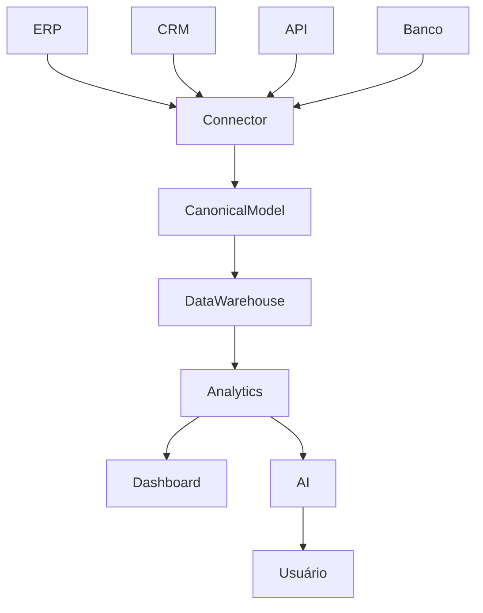

# 01 - Visão do Produto

**Projeto:** Enterprise Intelligence Platform (EIP)

**Versão:** 0.1

**Status:** Em elaboração

**Última atualização:** Julho/2026

---

# Sumário

1. Introdução
2. Visão Geral
3. Problema
4. Objetivo
5. Missão
6. Visão
7. Valores
8. Público-alvo
9. Personas
10. Casos de Uso
11. Diferenciais
12. Arquitetura Conceitual
13. Módulos da Plataforma
14. Modelo Comercial
15. Roadmap
16. Objetivos Técnicos
17. Objetivos de Negócio
18. Riscos
19. Critérios de Sucesso

---

# 1. Introdução

A Enterprise Intelligence Platform (EIP) é uma plataforma SaaS de Inteligência Corporativa desenvolvida para centralizar dados empresariais, integrar diferentes sistemas, fornecer análises avançadas, inteligência artificial e automação de processos.

Ao contrário das ferramentas tradicionais de Business Intelligence, a plataforma não possui foco apenas em dashboards.

Seu objetivo é tornar-se o centro de inteligência operacional das empresas.

---

# 2. Visão Geral

A plataforma será responsável por:

- Integrar qualquer ERP
- Integrar CRM
- Integrar Sistemas Financeiros
- Integrar APIs
- Integrar Bancos de Dados
- Integrar Arquivos

Após a integração, todos os dados serão transformados para um modelo canônico.

A partir desse modelo serão disponibilizados:

- Dashboards
- KPIs
- Indicadores
- Relatórios
- Inteligência Artificial
- Alertas
- Automações
- Agentes Inteligentes

---

# 3. Problema

Hoje as empresas enfrentam diversos desafios.

Entre eles:

- Dados espalhados em vários sistemas.

- Baixa integração entre plataformas.

- Dependência de especialistas em BI.

- Dificuldade para criar indicadores.

- Baixa utilização da Inteligência Artificial.

- Processos manuais para geração de informações.

- Tempo elevado para tomada de decisão.

A plataforma foi concebida para resolver esses problemas.

---

# 4. Objetivo

Criar uma plataforma única capaz de conectar qualquer sistema empresarial, consolidar informações e transformar dados em inteligência para apoio à decisão.

---

# 5. Missão

Democratizar o acesso à Inteligência Corporativa através de uma plataforma simples, escalável e baseada em Inteligência Artificial.

---

# 6. Visão

Ser uma das principais plataformas mundiais de Inteligência Corporativa baseada em IA.

---

# 7. Valores

- Simplicidade

- Performance

- Escalabilidade

- Segurança

- Transparência

- Inovação

- Inteligência

---

# 8. Público-Alvo

Inicialmente:

- Empresas que utilizam ERP.

Especialmente:

- Indústrias

- Distribuidoras

- Comércio

- Prestadores de Serviço

Posteriormente:

Qualquer empresa que possua dados digitais.

---

# 9. Personas

## CEO

Necessita acompanhar indicadores estratégicos.

Deseja conversar com a IA.

Receber recomendações.

Visualizar tendências.

---

## Diretor Financeiro

Fluxo de Caixa

Receitas

Custos

Margens

EBITDA

---

## Gerente Comercial

Vendas

Comissões

Metas

Clientes

Produtos

---

## Controller

KPIs

Comparativos

Forecast

Orçamento

---

## Analista

Construção de Dashboards.

Integrações.

Consultas.

Exportações.

---

# 10. Casos de Uso

## Caso 01

O usuário conecta o ERP.

A plataforma identifica automaticamente:

Clientes

Produtos

Pedidos

Financeiro

Estoque

Produção

Compras

---

## Caso 02

A plataforma constrói automaticamente dashboards.

---

## Caso 03

O CEO pergunta:

"Como está minha empresa hoje?"

A IA responde utilizando os dados da empresa.

---

## Caso 04

O gestor pergunta:

"Por que caiu minha margem?"

A IA identifica automaticamente os fatores responsáveis.

---

## Caso 05

O diretor solicita:

"Gere uma previsão de vendas para os próximos 90 dias."

---

# 11. Diferenciais

Modelo Canônico.

Conectores.

IA Conversacional.

Agentes Inteligentes.

Automações.

Marketplace.

White Label.

Multi ERP.

API First.

Cloud Native.

---

# 12. Arquitetura Conceitual

---

# 13. Módulos

Identity

Analytics

Dashboard

AI

Connectors

Automation

Notification

Billing

Marketplace

Administration

---

# 14. Modelo Comercial

Plano Starter

Plano Business

Plano Enterprise

Cobrança baseada em:

Número de Empresas

Número de Usuários

Número de Conectores

Consumo de IA

Armazenamento

---

# 15. Roadmap

## MVP

Autenticação

Conector REST

Dashboard

KPIs

IA Básica

---

## V2

Dashboard Builder

Marketplace

Agentes

Redis

RabbitMQ

---

## V3

Machine Learning

SDK

Marketplace de Conectores

Mobile

White Label

---

# 16. Objetivos Técnicos

Arquitetura Modular.

Cloud Native.

Microsserviços.

Escalabilidade Horizontal.

Alta Disponibilidade.

Alta Performance.

API First.

---

# 17. Objetivos de Negócio

Construir um produto SaaS.

Expandir para outros países.

Criar Marketplace.

Criar SDK.

Criar Ecossistema.

---

# 18. Riscos

Complexidade dos conectores.

Escalabilidade.

Custos com IA.

Padronização dos dados.

Qualidade das integrações.

---

# 19. Critérios de Sucesso

Tempo médio de implantação.

Número de conectores.

Número de clientes.

Disponibilidade.

Tempo de resposta.

Acurácia da IA.

Satisfação dos clientes.

---

# Conclusão

A Enterprise Intelligence Platform representa uma evolução das ferramentas tradicionais de Business Intelligence.

O objetivo não é apenas construir dashboards.

O objetivo é construir uma plataforma capaz de compreender os dados da empresa, gerar conhecimento, apoiar decisões e executar automações utilizando Inteligência Artificial.

Essa visão orientará todas as decisões técnicas, arquiteturais e comerciais das próximas fases do projeto.