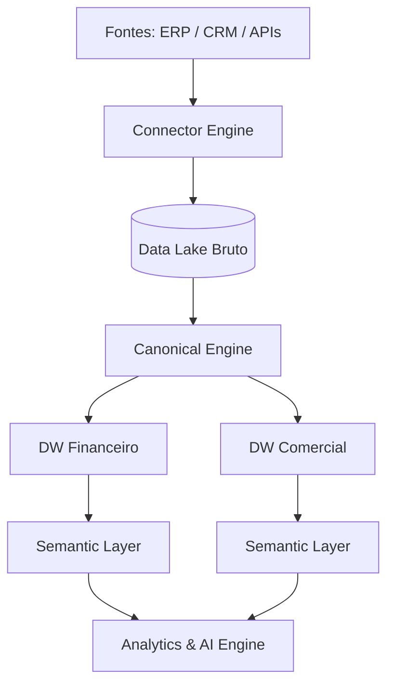

# 02 - Arquitetura da Plataforma

**Projeto:** Enterprise Intelligence Platform (EIP)  
**Versão:** 0.1  
**Status:** Oficial  

---

# Sumário

1. Introdução
2. Objetivos Arquiteturais
3. Princípios Arquiteturais
4. Visão Geral da Plataforma
5. Arquitetura SaaS
6. Modelo Multi-Tenant (Estratégia Híbrida)
7. Workspace
8. Estratégia Híbrida de Armazenamento de Dados
9. Arquitetura Baseada em Domínios (Domain Driven Design)
10. Considerações Finais

---

# 1. Introdução

Este documento define a arquitetura oficial da **Enterprise Intelligence Platform (EIP)**. Seu objetivo é estabelecer os padrões técnicos, arquiteturais e estruturais que serão utilizados durante todo o ciclo de vida da plataforma.

A arquitetura foi concebida para suportar nativamente:
* Aplicações SaaS de alta performance.
* Múltiplos clientes (**Multi-Tenant**) e múltiplas empresas por cliente.
* Integração com múltiplos ERPs simultâneos.
* Processamento distribuído de grandes volumes de dados (Big Data).
* Arquitetura voltada para Inteligência Artificial e crescimento horizontal linear.

> 💡 **Nota:** Este documento servirá como a única fonte de verdade e referência para todas as decisões técnicas e contratações de engenharia do projeto.

---

# 2. Objetivos Arquiteturais

A arquitetura foi desenhada sob os seguintes pilares fundamentais:

### 2.1 Escalabilidade
A plataforma deve crescer de forma horizontal e linear. Cada serviço deve ser escalado independentemente com base em gargalos específicos de processamento.

```
[100 Usuários]  ➔ [1 Instância Analytics]
      │
      ▼ (Crescimento)
[1000 Usuários] ➜ [5 Instâncias Analytics]
```
*Garante eficiência de custos sem a necessidade de escalar toda a aplicação de forma monolítica.*

### 2.2 Alta Disponibilidade
O isolamento de falhas é mandatório. A indisponibilidade de um serviço periférico ou de IA não pode interromper as funções vitais da plataforma.
* **Cenário A:** Caso o serviço de IA falhe, os Dashboards operam normalmente.
* **Cenário B:** Se o sistema de notificações parar, o motor de Analytics continua processando.

### 2.3 Modularidade
Toda funcionalidade deve estar estritamente desacoplada em módulos com responsabilidades únicas e bem definidas: `Analytics`, `Dashboard`, `Conectores`, `IA`, `Automação`, `Billing` e `Identity`.

### 2.4 Evolução Contínua
Permite a evolução da plataforma sem reescrever ou impactar componentes estáveis existentes.
* **Exemplo:** Adicionar um conector SAP não exige alteração no Analytics.
* **Exemplo:** Atualizar um modelo de LLM na IA não exige alteração nos Dashboards.

### 2.5 Cloud Native
Toda a infraestrutura é preparada para ambientes de nuvem modernos, baseando-se em containers, observabilidade nativa e evolução progressiva para orquestração e auto-scaling quando a operação exigir.

---

# 3. Princípios Arquiteturais

| Princípio | Descrição Operacional |
| :--- | :--- |
| **API First** | Todas as capacidades de negócio são expostas por APIs estruturadas. Nenhum módulo depende de dados internos de outro; toda comunicação ocorre por contratos públicos. |
| **DDD** | Organização focada no Domínio de Negócio (`Identity`, `Analytics`, `Connector`, etc.). Cada domínio possui sua própria responsabilidade e regras. |
| **Clean Architecture** | Código padronizado em camadas isoladas: `API ➔ Application ➔ Domain ➔ Infrastructure`. Garante alto índice de testabilidade e desacoplamento de frameworks. |
| **SOLID** | Padrões de design orientados a objetos estritamente aplicados para garantir legibilidade, manutenibilidade e facilidade de extensão de código. |
| **Event Driven** | Processamentos assíncronos e pesados (ETL, IA, E-mails) nunca rodam sob requisições HTTP síncronas. Utilização mandatória de filas e eventos. |
| **Security by Design** | A segurança não é um checklist tardio. Todo serviço nasce com `Autenticação`, `Autorização estruturada`, `Logs de Auditoria`, `Criptografia` e conformidade à `LGPD`. |

---

# 4. Visão Geral da Arquitetura

A plataforma é estruturada em camadas lógicas independentes que se comunicam de forma descendente por meio de contratos rígidos:

```text
                      Enterprise Intelligence Platform
┌─────────────────────────────────────────────────────────────────────────────┐
│                             Presentation Layer                              │
│            Angular Web • Mobile • Public API • SDK • Marketplace            │
└─────────────────────────────────────────────────────────────────────────────┘
                                     │
                                     ▼
┌─────────────────────────────────────────────────────────────────────────────┐
│                                API Gateway                                  │
│       Authentication • Rate Limit • Routing • Versioning • Logging          │
└─────────────────────────────────────────────────────────────────────────────┘
                                     │
                                     ▼
═══════════════════════════════════════════════════════════════════════════════
                               PLATFORM CORE
    Identity Engine • Tenant Engine • Workspace Engine • Billing Engine 
═══════════════════════════════════════════════════════════════════════════════
                                     │
                                     ▼
═══════════════════════════════════════════════════════════════════════════════
                               DATA PLATFORM
    Connector Engine ➔ Pipeline Engine ➔ Canonical Engine ➔ Data Lake Engine
═══════════════════════════════════════════════════════════════════════════════
                                     │
                                     ▼
═══════════════════════════════════════════════════════════════════════════════
                           INTELLIGENCE PLATFORM
     Analytics Engine • Dashboard Engine • AI Engine • Automation Engine
═══════════════════════════════════════════════════════════════════════════════
                                     │
                                     ▼
═══════════════════════════════════════════════════════════════════════════════
                             PLATFORM SERVICES
   Redis • RabbitMQ • Object Storage • Search • Scheduler • Monitoring
═══════════════════════════════════════════════════════════════════════════════
                                     │
                                     ▼
═══════════════════════════════════════════════════════════════════════════════
                            EXTERNAL ECOSYSTEM
      ERPs (SAP, Protheus) • CRMs • Databases • REST/GraphQL • Kafka • IoT
═══════════════════════════════════════════════════════════════════════════════
```

### Fluxo Simplificado de Dependência
```
Presentation Layer ➔ API Gateway ➔ Platform Core ➔ Data Platform ➔ Intelligence Platform ➔ Infrastructure
```

---

# 5. Arquitetura SaaS

## 5.1 Visão Geral
A EIP foi concebida sob o modelo **SaaS (Software as a Service)**. Uma infraestrutura unificada atende múltiplos clientes simultaneamente, isolando logicamente as camadas de dados e garantindo eficiência de custo. Cada cliente/organização contratante é denominado **Tenant**, representando o nível máximo de isolamento administrativo da plataforma.

## 5.2 Objetivos da Arquitetura SaaS
* Escalar horizontalmente acompanhando a entrada de novos clientes.
* Isolar completamente os dados entre as organizações.
* Suportar diferentes planos comerciais e limites operacionais.
* Reduzir custos operacionais compartilhando a mesma infraestrutura subjacente.
* Permitir atualizações centralizadas sem downtime para a base de clientes.

## 5.3 Estrutura Hierárquica
A árvore organizacional mapeia a governança corporativa em profundidade:

```text
Plataforma
└── Tenant
    ├── Empresas (Multi-Company)
    │   ├── Filiais
    │   ├── Departamentos
    │   └── Centros de Custo
    └── Recursos Vinculados
        ├── Usuários, Papéis & Permissões
        ├── Conectores & Dashboards
        └── Modelos de IA & Workflows
```

## 5.4 Conceito de Tenant
O Tenant é a raiz de toda a operação. Nenhum registro, métrica, usuário ou fonte de dados pode existir de forma órfã na plataforma; tudo pertence obrigatoriamente a um Tenant ID, garantindo isolamento, segurança e governança total.

## 5.5 Relação com a Arquitetura Geral
O contexto do Tenant acompanha a requisição desde o momento em que entra no API Gateway. O cabeçalho contendo o Tenant contextualizado é avaliado de ponta a ponta (computação, filas, armazenamento e queries), mitigando riscos de vazamento de dados (*data leakage*).

---

# 6. Modelo Multi-Tenant (Estratégia Híbrida)

A EIP utiliza um modelo híbrido para armazenamento e isolamento de banco de dados, equilibrando o custo de infraestrutura com requisitos rígidos de conformidade Enterprise.

```text
                      [ Estratégia Híbrida de Ingestão ]
                                      │
           ┌──────────────────────────┴──────────────────────────┐
           ▼                                                     ▼
   [ Shared Database ]                                  [ Dedicated Database ]
 ┌───────────────────┐                                  ┌────────────────────┐
 │    Database A     │                                  │   Database Tenant  │
 │ ├─ Tenant 1 (Id)  │                                  │   (Isolamento      │
 │ └─ Tenant 2 (Id)  │                                  │    Físico Total)   │
 └───────────────────┘                                  └────────────────────┘
```

### Modelos Suportados
1. **Shared Database (Banco Compartilhado):** Ideal para clientes de pequeno e médio porte. Os dados são consolidados na mesma base, separados estritamente por chaves lógicas indexadas e checados via código e políticas de segurança na camada de dados.
2. **Dedicated Database (Banco Dedicado):** Focado em clientes corporativos (Enterprise). O Tenant possui um banco de dados físico ou instância isolada, atendendo a critérios de segurança rigorosos e permitindo janelas de manutenção customizadas.

### Resolução Dinâmica de Conexão
A aplicação é agnóstica em relação à topologia física do banco. Uma camada especializada (`Tenant/Connection Resolver`) intercepta e injeta a conexão adequada em tempo de execução:
```text
Usuário ➔ Autenticação ➔ Identificação do Tenant ➔ Tenant Resolver ➔ Connection Resolver ➔ Banco Destino
```

> 🔄 **Migração Transparente:** A arquitetura provê ferramentas nativas para mover um Tenant do modelo *Shared* para o modelo *Dedicated* de forma assistida e automatizada, executando a cópia dos dados e virada de chaves sem necessidade de refatorar códigos da aplicação.

---

# 7. Workspace

## 7.1 Conceito e Escopo
Se o *Tenant* reflete o contrato comercial da empresa, o **Workspace** é o ambiente de trabalho prático do usuário. Um Tenant pode criar múltiplos Workspaces para segregar operações, projetos ou escopos de negócio distintos.

```text
Platform ── Tenant ┌── Workspace Financeiro (DW Próprio)
                   ├── Workspace Comercial (DW Próprio)
                   └── Workspace Industrial (DW Próprio)
```

## 7.2 Controle de Acesso Baseado em Workspace
O acesso é granular. Um usuário técnico ou gestor pode possuir acessos validados em determinados Workspaces e restrição total em outros:
* 🟩 **Workspace Financeiro:** Acesso Liberado (Escrita/Leitura)
* 🟩 **Workspace Comercial:** Acesso Liberado (Apenas Leitura)
* 🟥 **Workspace RH:** Acesso Negado

## 7.3 Casos de Uso Comuns
* **Segregação por Departamentos:** Divisão de contextos como Financeiro, Comercial, Produção e RH.
* **Ambientes de Ciclo de Vida:** Separação entre Workspaces de *Desenvolvimento*, *Homologação* e *Produção*.
* **B2B / Consultorias:** Empresas parceiras que gerenciam a inteligência de múltiplos clientes finais sob o mesmo Tenant principal.

---

# 8. Estratégia Híbrida de Armazenamento de Dados

A plataforma separa rigidamente o ecossistema de ingestão de dados brutos (*Data Lake Corporativo*) das áreas de consumo analítico segmentado (*Data Warehouses localizados por Workspace*).

## 8.1 Arquitetura Geral de Dados

```text
                                  Tenant
                                    │
                    ┌───────────────┴───────────────┐
                    │     Data Lake Corporativo     │ (Single Source of Truth)
                    └───────────────┬───────────────┘
                                    │
                             Modelo Canônico
                                    │
           ┌────────────────────────┼────────────────────────┐
           ▼                        ▼                        ▼
  Workspace Financeiro     Workspace Comercial      Workspace Industrial
 ┌────────────────────┐   ┌────────────────────┐   ┌────────────────────┐
 │ Data Warehouse     │   │ Data Warehouse     │   │ Data Warehouse     │
 │ Semantic Layer     │   │ Semantic Layer     │   │ Semantic Layer     │
 │ Analytics / Dash   │   │ Analytics / Dash   │   │ Analytics / Dash   │
 │ AI Engine          │   │ AI Engine          │   │ AI Engine          │
 └────────────────────┘   ┌────────────────────┐   └────────────────────┘
```

## 8.2 Descrição das Camadas de Armazenamento

* **Data Lake Corporativo:** Camada central imutável. Armazena os dados extraídos das origens em seu formato bruto (JSON, CSV, tabelas de ERP, XMLs, arquivos de texto). Funciona como a **Fonte Única da Verdade**. Não é exposto para consultas diretas dos usuários devido ao alto custo computacional e falta de tratamento de regras de negócio.
* **Modelo Canônico:** Abstração crítica que padroniza os dados brutos de fontes distintas para um dicionário de dados universal. Por exemplo, registros como `SA1010` (Protheus), `KNA1` (SAP) ou `CLIENTS` (Oracle CRM) são processados e unificados sob a entidade padrão única `Customer`.
* **Data Warehouse por Tenant:** Camada analítica otimizada para leitura que ingere dados padronizados do Modelo Canônico. Workspaces definem o consumo, as permissões, data marts e camadas semânticas por área (ex.: DRE no Financeiro, OEE na Indústria), sem exigir cópia física integral dos dados por workspace.

## 8.3 Fluxo de Dados Ponta a Ponta



---

# 9. Arquitetura Baseada em Domínios (Domain Driven Design)

## 9.1 Organização do System
Para evitar o acoplamento excessivo, a engenharia de software da EIP adota **DDD** como fundação. O sistema é quebrado em contextos delimitados (*Bounded Contexts*) auto-organizados:

```text
Platform Core          Data Platform          Intelligence Platform      Platform Services
├── Identity Domain    ├── Connector Domain   ├── Analytics Domain       ├── Catalog Domain
├── Tenant Domain      ├── Canonical Domain   ├── Dashboard Domain       ├── Billing Domain
└── Workspace Domain   └── Data Lake Domain   └── AI Domain              └── Monitoring Domain
```

## 9.2 Regras de Isolamento e Comunicação
* **Isolamento de Persistência:** Um domínio jamais realiza queries diretas nas tabelas ou bancos pertencentes a outro domínio.
* **Comunicação Segura:** Sempre que dados de outro contexto forem necessários, a transação deve ser operada invocando APIs REST/gRPC ou consumindo eventos de negócio postados em tópicos no Message Broker (`Event Driven`).
* **Estrutura de Código Unificada:** O MVP é entregue como um monólito modular organizado por domínios, seguindo **Clean Architecture** em `API`, `Application`, `Domain` e `Infrastructure`. Um módulo só é separado em microsserviço quando houver necessidade comprovada de escala, isolamento operacional ou ciclo de implantação independente.

---

# 10. Considerações Finais

Esta arquitetura híbrida e modular permite que novos módulos sejam adicionados sem alterar a camada de ingestão de dados. Além disso, diferentes Workspaces e Domínios podem evoluir de forma independente, mantendo consistência por meio do Modelo Canônico e compartilhando a mesma infraestrutura corporativa resiliente e segura.
