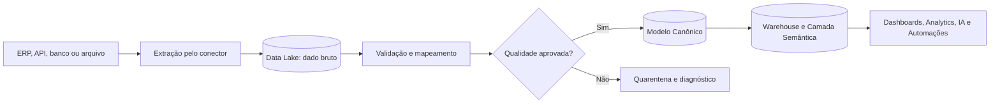

# 04 - Modelo Canônico de Dados

**Projeto:** Enterprise Intelligence Platform (EIP)  
**Versão:** 1.0  
**Status:** Oficial  
**Última atualização:** Julho/2026

---

# 1. Objetivo

O Modelo Canônico de Dados (Canonical Data Model — CDM) é o contrato interno que representa conceitos de negócio de maneira uniforme, independentemente de ERP, CRM, banco de dados, API ou arquivo de origem.

Ele evita que Analytics, Dashboards, IA e Automações precisem conhecer tabelas, siglas e regras particulares de cada sistema integrado. Cada conector traduz a origem para o CDM; os demais módulos consomem somente dados canônicos, camadas analíticas ou contratos explicitamente publicados.

```text
Origem específica → Conector → Dados brutos → Modelo Canônico → Warehouse/Semântica → Consumo
```

---

# 2. Princípios

- **Orientado ao negócio:** nomes e campos descrevem conceitos empresariais, não tabelas de ERP.
- **Independente da origem:** a mesma entidade atende múltiplos sistemas e conectores.
- **Extensível com governança:** novos campos ou entidades exigem versionamento e aprovação.
- **Rastreável:** todo registro mantém a origem, chave externa, execução e momento de carga.
- **Multi-tenant por definição:** nenhum registro canônico existe sem `TenantId`, `CompanyId` e contexto de origem.
- **Imutável na ingestão:** o dado bruto é preservado; correções e transformações geram novas versões processadas.
- **Qualidade mensurável:** validações, rejeições e alertas são parte do pipeline, não correções manuais invisíveis.

---

# 3. Escopo do MVP

O primeiro modelo canônico deve cobrir os domínios que permitem dashboards financeiros, comerciais e de estoque. O objetivo não é mapear todo o ERP na primeira integração.

| Domínio | Entidades mínimas | Exemplos de uso |
|---|---|---|
| Organização | Company, Branch, CostCenter | filtros, consolidação e permissões |
| Cadastros | Customer, Supplier, Product, ProductCategory | carteira, mix, clientes e compras |
| Comercial | SalesOrder, SalesOrderItem, SalesInvoice, SalesInvoiceItem | vendas, ticket médio, metas e margem |
| Financeiro | FinancialTitle, FinancialTransaction | contas a pagar/receber, caixa e inadimplência |
| Estoque | InventoryBalance, InventoryMovement, WarehouseLocation | saldo, giro e ruptura |
| Referência | Currency, ExchangeRate, PaymentTerm | padronização de valores e condições |

Produção, fiscal avançado, folha, orçamento, CRM e manutenção podem ser incluídos após validar o núcleo acima.

---

# 4. Estrutura Comum

Toda entidade canônica deve conter os campos abaixo, além dos campos específicos do domínio.

| Campo | Tipo lógico | Obrigatório | Descrição |
|---|---|---:|---|
| `Id` | UUID | Sim | Identificador técnico interno e estável da entidade |
| `TenantId` | UUID | Sim | Organização proprietária dos dados |
| `CompanyId` | UUID | Sim* | Empresa a que o registro pertence; `*` exceto entidades globais do tenant |
| `BranchId` | UUID | Não | Filial, quando a origem permitir essa identificação |
| `SourceSystemId` | UUID | Sim | Sistema/conector de origem configurado na EIP |
| `SourceEntity` | string | Sim | Recurso, tabela ou endpoint de origem |
| `SourceRecordId` | string | Sim | Chave original do registro na fonte |
| `SourceUpdatedAt` | datetime UTC | Não | Última alteração indicada pela fonte |
| `IngestedAt` | datetime UTC | Sim | Momento da captura pela EIP |
| `ProcessedAt` | datetime UTC | Sim | Momento da transformação canônica |
| `IsDeleted` | boolean | Sim | Indica exclusão lógica detectada na fonte |
| `SchemaVersion` | string | Sim | Versão do contrato canônico aplicado |
| `CorrelationId` | string | Sim | Rastreia a execução ponta a ponta |
| `RawObjectUri` | string | Sim | Referência ao dado bruto preservado no Data Lake |

## 4.1 Identidade e unicidade

O identificador `Id` é gerado pela EIP. A identidade de negócio de um registro vindo de uma fonte é composta por:

```text
TenantId + SourceSystemId + SourceEntity + SourceRecordId
```

Essa combinação deve ser única. Códigos de negócio, como `CustomerCode` ou `InvoiceNumber`, não substituem a chave técnica: eles podem se repetir entre empresas, filiais, séries ou sistemas.

## 4.2 Datas, valores e texto

- Todas as datas e horas técnicas são armazenadas em UTC no formato ISO 8601.
- Datas de negócio sem hora, como vencimento e emissão, usam o tipo `date` e preservam o calendário local da empresa.
- Valores monetários usam decimal de precisão fixa, nunca `float`.
- Moedas usam ISO 4217, como `BRL` e `USD`.
- Países usam ISO 3166-1 alpha-2, como `BR`.
- Textos são UTF-8; campos de código preservam zeros à esquerda e não podem ser convertidos automaticamente em número.

---

# 5. Entidades Canônicas do MVP

Os campos indicados como obrigatórios devem estar presentes ou ser explicitamente marcados como indisponíveis pelo conector. Campos opcionais não podem receber valores inventados.

## 5.1 Organização

### Company

Representa uma empresa legal ou unidade empresarial analisável dentro de um tenant.

| Campo | Tipo | Obrigatório | Descrição |
|---|---|---:|---|
| `LegalName` | string | Sim | Razão social ou nome corporativo |
| `TradeName` | string | Não | Nome fantasia |
| `TaxId` | string | Não | Documento fiscal, normalizado sem definir formato local como regra global |
| `CountryCode` | string | Sim | País da empresa |
| `DefaultCurrencyCode` | string | Sim | Moeda de operação padrão |
| `IsActive` | boolean | Sim | Situação operacional |

### Branch e CostCenter

`Branch` representa filial, estabelecimento ou unidade da empresa. `CostCenter` representa uma estrutura de apropriação financeira, hierárquica quando a origem fornecer relação de pai e filho.

Campos mínimos adicionais: `Code`, `Name`, `CompanyId`, `IsActive`; para centro de custo, `ParentCostCenterId` é opcional.

## 5.2 Cadastros

### Customer e Supplier

Clientes e fornecedores têm estruturas semelhantes, mas permanecem entidades distintas por suas regras de negócio.

| Campo | Tipo | Obrigatório | Descrição |
|---|---|---:|---|
| `Code` | string | Sim | Código preservado da origem |
| `Name` | string | Sim | Nome ou razão social |
| `TaxId` | string | Não | Documento fiscal |
| `Email` | string | Não | E-mail de contato, quando necessário para o caso de uso |
| `City` | string | Não | Cidade |
| `StateOrRegion` | string | Não | Estado ou região |
| `CountryCode` | string | Não | País |
| `IsActive` | boolean | Sim | Situação cadastral conhecida |

### Product e ProductCategory

| Campo | Tipo | Obrigatório | Descrição |
|---|---|---:|---|
| `Code` | string | Sim | Código do produto/serviço na origem |
| `Name` | string | Sim | Descrição comercial |
| `ProductType` | enum | Sim | `Product`, `Service` ou `Other` |
| `CategoryId` | UUID | Não | Categoria canônica associada |
| `UnitOfMeasure` | string | Não | Unidade de medida informada pela origem |
| `IsActive` | boolean | Sim | Situação cadastral |

`ProductCategory` possui `Code`, `Name` e `ParentCategoryId` opcional para hierarquias.

## 5.3 Comercial

### SalesOrder e SalesOrderItem

Representam pedido comercial, não faturamento. Devem ser usados para carteira e previsão operacional, sem substituir a nota/fatura.

`SalesOrder` contém: `OrderNumber`, `OrderDate`, `CustomerId`, `Status`, `CurrencyCode`, `GrossAmount`, `DiscountAmount`, `NetAmount` e `ExpectedDeliveryDate` opcional.

`SalesOrderItem` contém: `SalesOrderId`, `LineNumber`, `ProductId`, `Description`, `Quantity`, `UnitPrice`, `DiscountAmount`, `GrossAmount` e `NetAmount`.

### SalesInvoice e SalesInvoiceItem

Representam o documento de faturamento que será a fonte padrão de receita realizada no MVP.

| Campo | Tipo | Obrigatório | Descrição |
|---|---|---:|---|
| `InvoiceNumber` | string | Sim | Número do documento na origem |
| `Series` | string | Não | Série ou identificador complementar |
| `IssueDate` | date | Sim | Data de emissão |
| `CustomerId` | UUID | Sim | Cliente faturado |
| `SalesOrderId` | UUID | Não | Pedido de origem, quando identificado |
| `Status` | enum | Sim | Situação canônica do documento |
| `CurrencyCode` | string | Sim | Moeda do documento |
| `GrossAmount` | decimal(19,4) | Sim | Valor antes de descontos/impostos conforme regra documentada |
| `DiscountAmount` | decimal(19,4) | Sim | Total de descontos |
| `TaxAmount` | decimal(19,4) | Não | Total de impostos disponível |
| `NetAmount` | decimal(19,4) | Sim | Valor líquido conforme regra canônica |
| `CanceledAt` | datetime UTC | Não | Momento do cancelamento, quando houver |

`SalesInvoiceItem` contém a referência a fatura, linha, produto, quantidade, preços, descontos, impostos e valores bruto/líquido. O item é a granularidade preferencial para análises de produto, categoria e margem.

## 5.4 Financeiro

### FinancialTitle

Representa uma obrigação ou direito financeiro, como título a pagar ou receber. Não deve ser confundido com o documento comercial que o originou.

| Campo | Tipo | Obrigatório | Descrição |
|---|---|---:|---|
| `TitleNumber` | string | Sim | Identificador do título na origem |
| `TitleType` | enum | Sim | `AccountsReceivable` ou `AccountsPayable` |
| `IssueDate` | date | Sim | Data de emissão/criação |
| `DueDate` | date | Sim | Data de vencimento |
| `OriginalAmount` | decimal(19,4) | Sim | Valor original |
| `OpenAmount` | decimal(19,4) | Sim | Saldo em aberto no momento da carga |
| `PaidAmount` | decimal(19,4) | Sim | Total liquidado conhecido |
| `Status` | enum | Sim | `Open`, `PartiallyPaid`, `Paid`, `Canceled`, `Overdue` |
| `CounterpartyId` | UUID | Não | Customer ou Supplier, modelado por referência tipada |
| `CostCenterId` | UUID | Não | Centro de custo, se disponível |

### FinancialTransaction

Representa movimento de caixa ou liquidação financeira. Campos mínimos: `TransactionDate`, `TransactionType` (`Receipt`, `Payment`, `Transfer`, `Adjustment`), `Amount`, `CurrencyCode`, `FinancialTitleId` opcional, `BankAccountReference` opcional e `CostCenterId` opcional.

## 5.5 Estoque

### InventoryBalance

É o saldo de um produto em um local na data/hora de referência. Sua chave de negócio inclui produto, localização e instante de referência.

Campos: `ProductId`, `WarehouseLocationId`, `AsOfAt`, `OnHandQuantity`, `ReservedQuantity` opcional, `AvailableQuantity`, `UnitCost` opcional e `TotalCost` opcional.

### InventoryMovement

Registra entrada, saída, transferência, ajuste ou produção que altere estoque.

Campos: `ProductId`, `WarehouseLocationId`, `OccurredAt`, `MovementType`, `Quantity`, `UnitCost` opcional, `TotalCost` opcional, `ReferenceDocument` opcional e `CounterpartyId` opcional.

---

# 6. Regras de Negócio e Normalização

## 6.1 Valores e sinais

- Valores monetários são armazenados como números positivos; o sentido econômico é definido pelo tipo/status do documento ou movimento.
- Quantidades em `InventoryMovement` usam sinal: entrada positiva e saída negativa. Transferências devem gerar dois movimentos vinculados, um de saída e outro de entrada.
- `NetAmount` deve obedecer a regra declarada pelo domínio e nunca ser recalculado silenciosamente quando a origem fornecer arredondamentos próprios.

## 6.2 Status canônicos

Cada conector deve mapear status de origem para enums canônicos e preservar o valor original em metadados de transformação. Status desconhecido não pode ser convertido automaticamente para `Active`, `Paid` ou `Completed`; deve gerar aviso de qualidade ou estado `Unknown` quando o enum o suportar.

## 6.3 Referências

Relações como cliente, produto e empresa usam IDs canônicos após a resolução de chaves. Enquanto a referência não puder ser resolvida, o registro é retido em quarentena ou processado com aviso explícito conforme a regra do pipeline; nunca com uma relação arbitrária.

---

# 7. Fluxo de Transformação



O conector é responsável por extrair, preservar e mapear. O pipeline canônico é responsável por validar, normalizar, resolver referências, registrar a linhagem e publicar os dados válidos.

---

# 8. Qualidade, Quarentena e Reconciliação

## 8.1 Validações mínimas

- presença de chaves de origem e contexto de tenant/empresa;
- tipos de dados válidos;
- datas coerentes, por exemplo vencimento anterior à emissão somente quando a regra de origem permitir;
- valores numéricos dentro de limites definidos;
- moeda, status e tipos pertencentes ao vocabulário canônico;
- referências resolvíveis ou tratadas segundo a política de exceção;
- ausência de duplicidade na chave técnica de origem.

## 8.2 Quarentena

Registros inválidos não seguem para o Warehouse. A EIP deve armazenar o motivo da rejeição, a referência ao dado bruto, o conector, a execução, o `CorrelationId` e a regra que falhou. O operador poderá corrigir o mapeamento e reprocessar a carga, mantendo auditoria.

## 8.3 Reconciliação

Cada sincronização deve registrar contagens extraídas, aceitas, atualizadas, excluídas, rejeitadas e processadas. Para domínios financeiros e comerciais, devem existir verificações de totais por período/origem que permitam comparar EIP e sistema fonte.

---

# 9. Versionamento e Evolução

O campo `SchemaVersion` identifica a versão do contrato usada no registro e nos eventos publicados.

- Campos opcionais podem ser adicionados em versão menor, desde que não alterem o significado existente.
- Renomear campo, alterar tipo, mudar semântica ou remover campo requer nova versão principal e período de compatibilidade.
- Cada mudança deve ter ADR ou registro de decisão, exemplos de mapeamento e plano de migração.
- Conectores declaram quais entidades e versões do CDM suportam.

Alterações nunca podem quebrar dashboards ou prompts já publicados sem migração explícita da camada semântica.

---

# 10. Responsabilidades

| Componente | Responsabilidade |
|---|---|
| Connector | Extrair, identificar origem e depositar o dado bruto |
| Data Lake | Preservar o dado recebido e sua linhagem |
| Pipeline/Canonical | Validar, normalizar, resolver referências e materializar o CDM |
| Catalog | Manter metadados, definições, proprietário e qualidade das entidades |
| Warehouse/Semantic | Organizar consumo analítico e definir métricas reutilizáveis |
| Dashboard/Analytics/AI | Consumir contratos canônicos ou semânticos; não acessar tabelas de ERP |

---

# 11. Itens Obrigatórios para o Primeiro Conector

Antes de considerar um conector pronto para produção, ele deve fornecer:

- mapeamento documentado de origem para CDM;
- identificação de chaves, frequência de sincronização e estratégia incremental;
- preservação do dado bruto;
- `TenantId`, empresa e linhagem preenchidos;
- tratamento de inclusão, alteração e exclusão lógica;
- relatório de qualidade e reconciliação por execução;
- casos de teste com dados representativos e cenários de erro;
- versão do CDM suportada e plano de compatibilidade.

---

# 12. Fora do Escopo Inicial

Não fazem parte da primeira versão do CDM:

- um modelo universal completo para todos os módulos de qualquer ERP;
- normalização fiscal específica de cada país;
- regras de cálculo de tributos;
- substituição do sistema transacional como fonte operacional;
- edição manual de dados brutos;
- métricas de dashboard embutidas no conector.

Esses itens serão tratados por extensões versionadas, camada semântica ou domínios próprios quando houver caso de uso validado.
