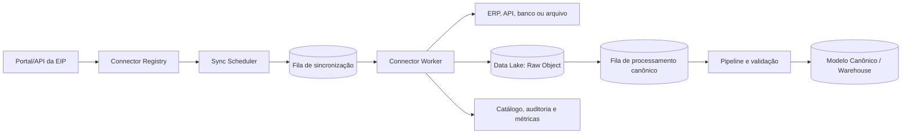

# 05 - Connector Framework

**Projeto:** Enterprise Intelligence Platform (EIP)  
**Versão:** 1.0  
**Status:** Oficial  
**Última atualização:** Julho/2026

---

# 1. Objetivo

O Connector Framework é a base de integração da EIP com ERPs, CRMs, bancos de dados, APIs e arquivos. Ele padroniza a forma de configurar, executar, monitorar e evoluir conectores, sem acoplar o restante da plataforma às particularidades de cada origem.

Um conector não entrega dashboards nem regras de negócio finais. Sua responsabilidade é capturar dados de uma origem, preservar o conteúdo bruto, informar sua linhagem e produzir entradas aptas à transformação para o Modelo Canônico.

```text
Fonte externa → Conector → Data Lake bruto → Pipeline Canônico → Warehouse/Semântica
```

---

# 2. Princípios

- **Contrato antes de implementação:** todo conector declara entidades, requisitos, capacidades e versão do CDM suportada.
- **Isolamento por tenant:** configuração, segredos, filas, objetos e logs são sempre associados ao tenant e à empresa corretos.
- **Segurança por padrão:** credenciais não são registradas em código, logs ou metadados comuns.
- **Execução assíncrona:** sincronizações são jobs rastreáveis, nunca requisições HTTP longas.
- **Idempotência:** reexecutar uma carga não deve duplicar dados canônicos.
- **Rastreabilidade total:** cada registro pode ser ligado à execução, conector e objeto bruto que o originou.
- **Falha recuperável:** erros isolam a unidade afetada e permitem retry ou reprocessamento sem perda da carga.
- **Extensibilidade governada:** um novo conector segue contratos técnicos e critérios de qualidade definidos.

---

# 3. Conceitos

| Conceito | Definição |
|---|---|
| Connector Type | Implementação reutilizável para um sistema ou protocolo, como `Protheus`, `REST API` ou `CSV` |
| Connector Instance | Configuração de um Connector Type para uma empresa, ambiente e credencial específicos |
| Source System | Representação da origem que recebe um `SourceSystemId` no modelo canônico |
| Dataset | Recurso extraído, como clientes, pedidos, títulos ou tabela SQL |
| Mapping | Tradução documentada entre o Dataset de origem e entidade canônica |
| Sync Job | Uma execução assíncrona de sincronização |
| Checkpoint | Estado de progresso usado na próxima extração incremental |
| Raw Object | Arquivo/objeto imutável com o conteúdo recebido da fonte |

Um tipo de conector pode ter várias instâncias. Exemplo: o tipo `Protheus` atende instâncias separadas para cada empresa, cliente ou ambiente (produção/homologação).

---

# 4. Arquitetura do Framework



## 4.1 Componentes

| Componente | Responsabilidade |
|---|---|
| Connector Registry | Mantém tipos, versões, capacidades, configurações e status das instâncias |
| Connector API | Expõe operações de configuração, teste de conexão e solicitação de sincronização |
| Sync Scheduler | Calcula execuções recorrentes, respeitando plano, janela e limite da origem |
| Connector Worker | Executa extração, paginação, checkpoint, persistência bruta e publicação de eventos |
| Secret Provider | Resolve credenciais em tempo de execução, sem expor seu valor ao domínio do conector |
| Data Lake | Armazena conteúdo bruto e metadados de linhagem |
| Pipeline Canônico | Converte dados brutos validados para o CDM |
| Catalog/Audit | Registra datasets, mapeamentos, execução, qualidade e histórico |

---

# 5. Ciclo de Vida da Instância

```text
Draft → Configuring → Validating → Active ↔ Paused → Disabled
                                  ↘ Error
```

- **Draft:** criada, mas ainda sem configuração válida.
- **Configuring:** parâmetros, mapeamentos e credenciais estão sendo definidos.
- **Validating:** a EIP testa conectividade, permissões e requisitos mínimos.
- **Active:** apta a sincronizações manuais ou agendadas.
- **Paused:** preserva configuração, mas não inicia novas execuções.
- **Error:** falha que exige atenção; execuções futuras seguem a política definida.
- **Disabled:** conector desativado de forma administrativa; credenciais podem ser removidas.

Alterações de credencial, escopo, mapeamento ou versão devem gerar auditoria e podem exigir uma validação antes de retornar a `Active`.

---

# 6. Contrato de um Connector Type

Cada implementação deve declarar metadados equivalentes ao exemplo abaixo:

```yaml
id: protheus
displayName: ERP Protheus
version: 1.0.0
authentication:
  - basic
  - oauth2
datasets:
  - customers
  - products
  - sales-invoices
  - financial-titles
capabilities:
  incrementalSync: true
  fullSync: true
  deletionDetection: configurable
  testConnection: true
  schedule: true
canonicalModel:
  version: 1.0
```

O contrato real será exposto pelo Registry e versionado junto ao código. Ele precisa informar:

- métodos de autenticação e parâmetros obrigatórios;
- datasets e entidades canônicas suportados;
- suporte a carga completa, incremental e detecção de exclusão;
- limites conhecidos da origem, como paginação ou rate limit;
- frequência mínima segura de sincronização;
- requisitos de permissão no sistema de origem;
- versão do CDM e dos mapeamentos disponibilizados.

---

# 7. Configuração e Credenciais

## 7.1 Configuração não sigilosa

Configurações versionadas pela EIP podem incluir URL/base, empresa de origem, dataset habilitado, janela de sincronização, fuso horário, filtros permitidos, tamanho de página e estratégia incremental.

Cada configuração pertence a um `TenantId`, `CompanyId` e `ConnectorInstanceId`. Mudanças devem criar histórico auditável com autor, data e justificativa.

## 7.2 Segredos

Tokens, senhas, chaves privadas e connection strings são mantidos em um provedor de segredos. O banco de dados da aplicação armazena apenas uma referência segura ao segredo.

Regras obrigatórias:

- nenhum segredo em código, arquivo versionado, evento, log ou mensagem de erro;
- acesso com menor privilégio possível e escopo exclusivo da origem;
- rotação sem exigir recriação da instância;
- mascaramento de valores em telas e logs;
- teste de conexão não revela detalhes sensíveis ao usuário.

No MVP, a implementação local pode usar configuração protegida para desenvolvimento. Em produção, deve ser utilizado um cofre de segredos gerenciado, conforme decisão de infraestrutura.

---

# 8. Estratégias de Sincronização

## 8.1 Carga completa

Lê todo o dataset disponível e estabelece uma base inicial. É utilizada na primeira ativação, em recuperação controlada ou quando a origem não oferece mecanismo incremental confiável.

## 8.2 Carga incremental

Lê apenas inclusões, alterações e, quando suportado, exclusões desde o último checkpoint válido. O checkpoint deve ter valor opaco para o framework e específico do conector, por exemplo data de atualização + chave, token de cursor ou versão da API.

O checkpoint só é confirmado após o conteúdo bruto estar persistido e o evento de processamento ser publicado com sucesso. Falhas devem permitir retomar com segurança, aceitando reprocessamento idempotente.

## 8.3 Webhook e eventos de origem

Quando uma fonte oferecer webhooks confiáveis, eles podem disparar uma sincronização incremental. O webhook não deve gravar diretamente no modelo canônico: ele é autenticado, registrado e transformado em job assíncrono.

## 8.4 Arquivos

Para CSV, Excel, XML e JSON, cada upload cria uma versão imutável do arquivo bruto. A configuração define layout, codificação, aba/recorte, delimitador e mapeamento. Alterações de layout exigem nova versão de configuração e validação.

---

# 9. Execução de Sincronização

Cada `Sync Job` segue estas etapas:

1. validar o estado da instância, tenant, empresa e limite operacional;
2. obter segredo temporariamente e abrir conexão com timeout;
3. extrair páginas ou lotes, respeitando rate limits da origem;
4. gravar cada lote como Raw Object, com checksum e metadados;
5. publicar evento de processamento canônico com referências aos objetos brutos;
6. avançar o checkpoint somente após confirmação segura;
7. consolidar contagens, duração, erros e qualidade em um relatório de execução.

Uma execução possui no mínimo: `SyncJobId`, `ConnectorInstanceId`, `TenantId`, `CompanyId`, tipo de execução, datasets, início/fim, status, checkpoint inicial/final, contagens e `CorrelationId`.

---

# 10. Confiabilidade, Retry e Idempotência

## 10.1 Idempotência

O worker pode receber o mesmo job mais de uma vez. A EIP deve identificar lotes e objetos já gravados por checksum, chave de execução e origem. A camada canônica aplica sua chave única definida no CDM, impedindo duplicidade lógica.

## 10.2 Retry

Falhas transitórias — rede, timeout, indisponibilidade temporária ou limite de API — usam retry exponencial com limite configurado. Não devem ser repetidas automaticamente falhas permanentes, como credencial inválida, escopo insuficiente ou mapeamento inválido.

## 10.3 DLQ e reprocessamento

Depois do limite de tentativas, o job ou evento segue para uma fila de mensagens mortas (DLQ), com diagnóstico suficiente para operação. A reexecução deve poder partir do job, de um dataset, de uma janela de tempo ou de um Raw Object específico, preservando a auditoria.

---

# 11. Qualidade e Observabilidade

Cada execução registra:

- quantidade extraída, persistida, enviada ao pipeline, aceita e rejeitada;
- tempo de conexão, extração e processamento;
- uso de páginas/lotes, rate limits e retries;
- checkpoint inicial/final;
- erros classificados por categoria, sem dados sensíveis;
- versão do Connector Type, configuração e CDM;
- referência aos objetos brutos e `CorrelationId`.

Métricas mínimas: taxa de sucesso, atraso desde a última sincronização bem-sucedida, duração, registros rejeitados, backlog de filas e disponibilidade por Connector Type.

Alertas devem cobrir falhas recorrentes, conector sem sincronização no período esperado, crescimento de DLQ, expiração próxima de credencial e queda anormal de volume extraído.

---

# 12. Segurança e Isolamento

- O contexto de tenant e empresa é definido pela instância e validado pelo worker; nunca é aceito cegamente da mensagem.
- Workers têm acesso somente aos segredos e objetos necessários à instância executada.
- Raw Objects devem ser particionados por tenant, empresa, instância, dataset e data de ingestão.
- Logs não podem conter payload completo ou PII sem política de mascaramento e retenção.
- Ações manuais — testar, ativar, pausar, sincronizar, reprocessar e alterar mapeamento — exigem permissão explícita e auditoria.
- Conectores de banco usam conta de leitura dedicada e permissões mínimas.

---

# 13. Desenvolvimento de Novo Conector

Um novo Connector Type deve seguir este processo:

1. registrar ADR ou decisão com objetivo, origem, dados e riscos;
2. definir datasets prioritários e mapeamento para a versão atual do CDM;
3. declarar contrato, parâmetros, autenticação e capacidades;
4. implementar teste de conexão, extração paginada e checkpoint;
5. persistir dado bruto e publicar eventos sem acoplamento ao Warehouse;
6. implementar tratamento de erros, retry, métricas e auditoria;
7. criar testes unitários, integração com uma origem simulada e casos de reprocessamento;
8. validar reconciliação de volume e valores com dados de referência;
9. documentar pré-requisitos, permissões, limites e operação.

Um conector não pode executar SQL arbitrário fornecido por usuário, scripts remotos não auditados ou código dinâmico dentro do ambiente de processamento.

---

# 14. Conectores Prioritários

A ordem será orientada por demanda comercial e acesso aos dados, mas o MVP deve iniciar com um único conector de referência. Candidatos iniciais:

| Tipo | Prioridade inicial | Objetivo |
|---|---:|---|
| REST API genérica | Alta | Validar o framework com contrato previsível |
| CSV/Excel | Alta | Onboarding rápido e importações controladas |
| SQL Server read-only | Média | Integração com bases corporativas existentes |
| Protheus | Conforme mercado-alvo | Conector ERP especializado após validar o núcleo |

Novos ERPs, CRMs e bancos serão priorizados a partir de clientes e datasets necessários, e não apenas pela quantidade de sistemas suportados.

---

# 15. Fora do Escopo Inicial

Não fazem parte da primeira versão do framework:

- marketplace público e SDK de terceiros;
- execução de código de conector fornecido pelo cliente;
- sincronização bidirecional ou escrita em ERPs;
- CDC em tempo real para todas as fontes;
- transformação de negócio dentro do conector;
- dashboard ou métrica específica embutida em um Connector Type.

Essas capacidades poderão ser introduzidas posteriormente por ADR, com modelo de permissões, isolamento de execução e governança adequados.
