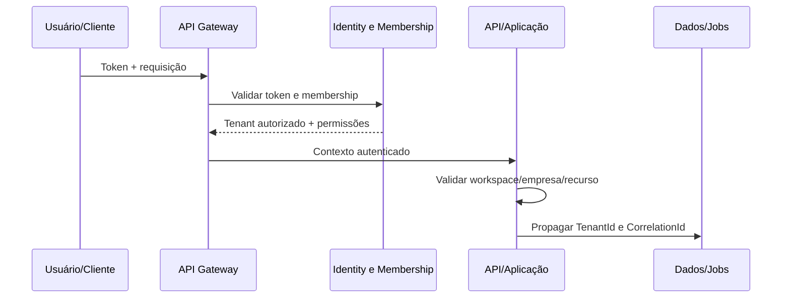

# 08 - Multi-Tenant

**Projeto:** Enterprise Intelligence Platform (EIP)  
**Versão:** 1.0  
**Status:** Oficial  
**Última atualização:** Julho/2026

---

# 1. Objetivo

Este documento define como a EIP atende múltiplas organizações na mesma plataforma, preservando isolamento de dados, autonomia administrativa e eficiência operacional.

Multi-tenancy não é apenas um campo no banco de dados. O contexto de tenant deve acompanhar identidade, autorização, APIs, jobs, eventos, cache, Object Storage, Data Lake, Warehouse, backups e auditoria.

---

# 2. Conceitos e Hierarquia

```text
Plataforma EIP
└── Tenant (organização contratante)
    ├── Empresas
    │   ├── Filiais
    │   ├── Centros de custo
    │   └── Fontes de dados / conectores
    ├── Workspaces
    │   ├── Dashboards, camadas semânticas e regras de acesso
    │   └── Contextos de consumo (Financeiro, Comercial, Produção etc.)
    ├── Usuários, grupos, papéis e permissões
    └── Plano, limites e configurações do tenant
```

| Conceito | Definição | Observação |
|---|---|---|
| Plataforma | Operação global da EIP | Administrada exclusivamente por perfis internos autorizados |
| Tenant | Organização contratante e fronteira principal de isolamento | Unidade de contrato, cobrança, retenção e administração |
| Company | Empresa legal ou unidade empresarial do tenant | Permite grupos econômicos e múltiplos ERPs |
| Branch | Filial/estabelecimento de uma empresa | Opcional conforme granularidade da origem |
| Workspace | Ambiente de trabalho e consumo analítico dentro do tenant | Não substitui empresa nem é uma fronteira entre tenants |
| User | Identidade que pode pertencer a um ou mais tenants | Acesso sempre é avaliado no tenant selecionado |
| Membership | Vínculo do usuário ao tenant, com papéis e escopo | Não há acesso implícito entre memberships |

---

# 3. Decisões Fundamentais

1. O tenant é a fronteira máxima de isolamento funcional e de dados.
2. Um tenant pode conter uma ou mais empresas e fontes de dados.
3. Um usuário pode participar de múltiplos tenants, mas precisa ter membership e permissões independentes em cada um.
4. Workspaces segmentam colaboração e consumo analítico dentro do tenant; não são substitutos de `TenantId` em regras de segurança.
5. Todo dado de negócio pertence a um tenant; dados empresariais também pertencem a uma empresa.
6. A plataforma suporta estratégia híbrida: banco compartilhado para perfis adequados e banco dedicado para requisitos enterprise.
7. O modelo físico de armazenamento é invisível ao consumidor e resolvido por serviço controlado.

---

# 4. Modelo de Entidades

## 4.1 Tenant

Campos mínimos:

| Campo | Descrição |
|---|---|
| `Id` | UUID interno e imutável |
| `Name` | Nome de exibição da organização |
| `Slug` | Identificador legível único, sujeito a regras de alteração |
| `Status` | `Provisioning`, `Active`, `Suspended`, `ReadOnly`, `Archived`, `Deleted` |
| `PlanId` | Plano contratado e limites aplicáveis |
| `DataIsolationMode` | `Shared` ou `Dedicated` |
| `DefaultTimezone` | Fuso para exibição e agendamento do tenant |
| `CreatedAt`, `UpdatedAt` | Auditoria técnica |

## 4.2 Membership e escopos

`Membership` associa um usuário a um tenant. Ela contém `UserId`, `TenantId`, status, papéis, permissões e escopos concedidos.

Escopos podem restringir acesso a empresas, filiais, workspaces ou recursos específicos. Ausência de escopo não pode ser interpretada automaticamente como acesso total: a permissão define se o escopo é obrigatório e qual comportamento deve ser aplicado.

## 4.3 Company, Branch e Workspace

- `Company` sempre pertence a um tenant e possui seu próprio status, dados fiscais e moeda padrão.
- `Branch` pertence a uma empresa; não pode ser ligada diretamente ao tenant.
- `Workspace` pertence a um tenant e possui membros/permissões próprios. Pode incluir uma ou mais empresas como escopo de consumo, sem alterar a propriedade dos dados.
- Conectores pertencem a uma empresa e ao tenant; a associação de workspace é opcional e nunca altera o contexto da extração.

---

# 5. Resolução de Contexto

O contexto é estabelecido no início da chamada e propagado de forma imutável para todas as operações subsequentes.



## 5.1 Fontes de contexto

- `TenantId`: obtido do token, seleção de membership ou sessão de forma controlada.
- `WorkspaceId`: opcional, recebido por header ou rota e validado contra a membership.
- `CompanyId`/`BranchId`: recebidos como filtro ou parte do recurso e validados contra tenant e escopos.
- `CorrelationId`: aceito ou gerado no Gateway; segue para logs, jobs e eventos.

O backend não deve confiar em `TenantId` enviado no corpo da requisição, no nome de um arquivo, em query string ou em mensagem sem validar a origem e a autorização.

## 5.2 Troca de tenant

Quando um usuário possui acesso a mais de um tenant, a troca deve ser explícita e visível. A nova seleção gera contexto/sessão atualizada; dados, permissões, cache e navegação do tenant anterior não podem permanecer acessíveis por acidente.

---

# 6. Autorização por Escopo

A autorização combina permissão e escopo.

| Exemplo de ação | Permissão | Escopo avaliado |
|---|---|---|
| Visualizar vendas | `analytics.query` | tenant, workspace e empresas liberadas |
| Configurar conector | `connectors.manage` | tenant e empresa do conector |
| Publicar dashboard | `dashboards.manage` | tenant e workspace |
| Gerenciar usuário | `members.manage` | tenant e, quando aplicável, workspace |
| Exportar relatório | `reports.export` | dado, tenant, workspace, empresas e classificação |
| Operar plataforma | permissão interna específica | tenant-alvo, justificativa e auditoria reforçada |

Regras:

- recursos são carregados já filtrados pelo tenant antes da decisão de negócio;
- uma empresa somente é acessível se pertencer ao tenant ativo e estiver no escopo da membership;
- workspace não concede acesso a dados empresariais fora do escopo permitido;
- APIs respondem `404` ou `403` conforme a política de não enumeração definida; nunca retornam dados parciais de outro tenant;
- toda elevação de privilégio e acesso de suporte é auditada.

---

# 7. Estratégia de Armazenamento Híbrida

## 7.1 Shared Database

No modo compartilhado, vários tenants usam a mesma infraestrutura física, com separação lógica obrigatória por `TenantId` e controles adicionais de banco.

Indicado para: clientes com requisitos padrão de custo, volume e conformidade.

Controles mínimos:

- `TenantId` em todas as tabelas pertencentes a tenant;
- índices e chaves únicas iniciando por `TenantId` quando apropriado;
- filtros globais/repositórios centralizados na aplicação;
- Row-Level Security (RLS) quando viável;
- conta de banco com privilégios mínimos;
- testes automatizados de tentativa de leitura/escrita cruzada;
- backup e restauração com procedimento de recuperação por tenant.

## 7.2 Dedicated Database

No modo dedicado, o tenant utiliza banco ou instância isolada para dados definidos na política de isolamento. O controle de plataforma e metadados globais podem permanecer em banco compartilhado, desde que não armazenem dados analíticos confidenciais do tenant sem decisão explícita.

Indicado para: requisitos contratuais/regulatórios, alto volume, residência de dados, performance isolada ou necessidade de janela de manutenção própria.

## 7.3 Tenant/Connection Resolver

O `Tenant/Connection Resolver` é o único componente que escolhe a conexão física. Ele recebe um contexto autorizado, consulta metadados protegidos e retorna a conexão do modo correto. Serviços de domínio não montam connection strings e não escolhem bancos por dados fornecidos pelo cliente.

---

# 8. Propagação em Toda a Plataforma

| Camada | Aplicação do contexto |
|---|---|
| API Gateway | valida identidade, cria correlação e encaminha contexto seguro |
| Backend | autoriza, filtra dados e registra auditoria |
| Banco | `TenantId`, filtros, constraints e RLS quando adotado |
| Cache | chave contém tenant, workspace/empresa, permissões e versão |
| RabbitMQ | envelope contém tenant, empresa quando aplicável, versão e correlação |
| Workers | validam o contexto contra a instância/configuração persistida |
| Object Storage | prefixo particionado e autorização para emissão de link temporário |
| Data Lake/Warehouse | partição e políticas por tenant/empresa/workspace |
| Observabilidade | correlação e identificadores seguros para investigação, sem PII desnecessária |
| Backup | criptografia, retenção e recuperação respeitam o tenant |

Exemplo de chave de cache segura:

```text
analytics:{tenantId}:{workspaceId}:{permissionScopeHash}:{queryVersion}:{queryHash}
```

---

# 9. Provisionamento e Ciclo de Vida

## 9.1 Criação

O provisionamento cria tenant, plano, administrador inicial, modo de isolamento, configurações padrão, auditoria e recursos mínimos. O tenant só se torna `Active` após validar as etapas obrigatórias.

## 9.2 Suspensão e read-only

- `Suspended`: bloqueia autenticação ou operações conforme regra comercial/segurança; dados são preservados segundo contrato.
- `ReadOnly`: permite consultas autorizadas, mas bloqueia mudanças, novas sincronizações e automações de escrita.
- `Archived`: encerra uso ativo e aplica retenção/backup controlados.

Essas transições não excluem dados automaticamente.

## 9.3 Exclusão

A exclusão exige autorização administrativa, confirmação, verificação de obrigações legais e prazo de recuperação definido. O processo deve remover ou anonimizar dados em bancos, Object Storage, cache, índices e camadas derivadas, mantendo somente registros legalmente exigidos. Toda operação é auditada.

---

# 10. Migração de Shared para Dedicated

A migração deve ser assistida e reversível até a virada final:

1. avaliar elegibilidade, capacidade e impacto;
2. provisionar infraestrutura dedicada e criptografia;
3. copiar dados com validação de contagem, integridade e linhagem;
4. sincronizar alterações ocorridas durante a cópia;
5. executar validação e janela de cutover;
6. atualizar o Connection Resolver de forma atômica;
7. monitorar e manter plano de rollback;
8. aplicar retenção segura à cópia anterior após o período aprovado.

Nenhuma migração pode ser disparada diretamente por usuário final sem processo operacional e autorização apropriada.

---

# 11. Planos, Limites e Quotas

O plano do tenant é a fonte de limites comerciais e técnicos, por exemplo:

- empresas, usuários, workspaces e conectores ativos;
- frequência e volume de sincronizações;
- armazenamento bruto e analítico;
- retenção de histórico e auditoria;
- consultas, exportações e uso de IA;
- quotas de API e concorrência de jobs.

Limites são verificados por serviços de domínio e não somente pela interface. Exceder um limite deve retornar mensagem clara, manter dados existentes íntegros e registrar o evento para operação/cobrança.

---

# 12. Observabilidade e Auditoria

Métricas por tenant são fundamentais para operação, mas não podem vazar informações entre clientes. A EIP monitora, no mínimo:

- status e atraso de conectores;
- uso de armazenamento, fila, API e IA;
- falhas de autorização e acessos negados;
- jobs executados, erro/retry/DLQ;
- consumo por plano e risco de quota;
- atividade administrativa e exportações.

Auditoria inclui criação e alterações de tenant, membership, papéis, escopos, modo de isolamento, plano, acesso de suporte, migrações e ações de exclusão.

---

# 13. Testes Obrigatórios

Cada módulo que manipule dados de tenant deve ter testes que comprovem:

- usuário do tenant A não lista, lê, atualiza ou exclui recurso do tenant B;
- filtros, IDs e payloads adulterados não atravessam a fronteira;
- cache e jobs não retornam ou processam dados com contexto incorreto;
- eventos e Raw Objects carregam contexto e são rejeitados se inconsistente;
- usuário multi-tenant não conserva permissões do tenant anterior após a troca;
- shared e dedicated usam o mesmo contrato funcional e autorizativo;
- operações de suporte possuem permissão e auditoria reforçadas.

---

# 14. Fora do Escopo Inicial

Não fazem parte da primeira entrega multi-tenant:

- hierarquias ilimitadas de organizações fora de Tenant → Company → Branch;
- delegação complexa entre tenants, franquias ou cobrança cruzada;
- réplica multi-região por tenant;
- escolha autônoma de região de dados pelo cliente sem capacidade operacional correspondente;
- migração automática para banco dedicado sem validação humana;
- compartilhamento direto de recursos entre tenants.

Qualquer necessidade de colaboração entre organizações deve ser modelada como contrato explícito, com autorização, auditoria e isolamento preservados.
