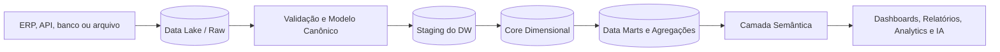

# 09 - Data Warehouse

**Projeto:** Enterprise Intelligence Platform (EIP)  
**Versão:** 1.0  
**Status:** Oficial  
**Última atualização:** Julho/2026

---

# 1. Objetivo

O Data Warehouse (DW) é a camada preparada para consultas analíticas consistentes, rápidas e governadas. Ele recebe dados validados do Modelo Canônico, organiza fatos e dimensões para consumo e alimenta a camada semântica, dashboards, relatórios, Analytics e IA.

O DW não substitui a fonte operacional, o Data Lake bruto nem o Modelo Canônico. Cada camada tem uma responsabilidade distinta:

```text
Fonte → Raw/Data Lake → Modelo Canônico → Data Warehouse → Semântica → Consumo
```

---

# 2. Princípios

- **Separação entre ingestão e consumo:** dashboards não consultam ERP, arquivo bruto ou tabelas de estágio.
- **Modelo dimensional:** fatos mensuráveis e dimensões descritivas facilitam consultas, desempenho e entendimento de negócio.
- **Grão explícito:** cada fato declara exatamente o que uma linha representa antes de receber métricas.
- **Histórico preservado:** alterações relevantes de dimensão e fatos são tratadas de forma rastreável.
- **Dados confiáveis antes de rápidos:** somente registros aprovados nas regras de qualidade chegam à camada de consumo.
- **Multi-tenant seguro:** tenant, empresa e workspace são aplicados em dados, consultas, cache e agregações.
- **Reprocessável:** toda carga pode ser rastreada até o CDM, objeto bruto e execução de conector.
- **Sem regra oculta de dashboard:** métricas reutilizáveis pertencem à camada semântica, não ao gráfico individual.

---

# 3. Arquitetura de Dados



## 3.1 Zonas

| Zona | Conteúdo | Consumidores permitidos |
|---|---|---|
| Raw / Data Lake | dado recebido, imutável e com linhagem | conectores, pipeline e operação autorizada |
| Canonical | entidades normalizadas conforme CDM | pipelines, catálogo e processos autorizados |
| Staging | lotes temporários prontos para carga dimensional | processos de Warehouse; não exposta ao usuário |
| Core Dimensional | fatos e dimensões conformadas | camada semântica e processos analíticos |
| Data Mart | visão por domínio, agregações e tabelas de alto consumo | semântica, relatórios e análises aprovadas |
| Semantic | métricas, nomes de negócio, relações e políticas | dashboard, Analytics, IA e API de consulta |

As zonas de Raw, Canonical e Staging não são superfícies públicas de consulta. O uso direto por dashboard é proibido.

---

# 4. Organização Física e Multi-Tenant

## 4.1 Modelo inicial

No MVP, o SQL Server é a plataforma analítica inicial. Cada tenant possui um escopo lógico de DW. A implementação segue o modo de isolamento do tenant:

- **Shared:** tabelas e partições compartilhadas, com `TenantId` obrigatório, filtros centralizados, RLS obrigatória (sem exceção) e índices iniciados por tenant quando fizer sentido.
- **Dedicated:** banco ou ambiente analítico isolado para tenants elegíveis, resolvido pelo Tenant/Connection Resolver.

## 4.2 Workspace

O workspace é uma fronteira de consumo, não uma nova propriedade do dado de origem. O mesmo fato canônico pode atender mais de um workspace autorizado. Data marts, conjuntos semânticos, dashboards e políticas de visibilidade podem ser específicos de workspace.

Toda consulta à camada semântica valida `TenantId`, `WorkspaceId`, empresas permitidas e permissões. O DW não cria cópias de dados por workspace salvo quando uma agregação/materialização justificada exigir.

---

# 5. Modelagem Dimensional

## 5.1 Convenções

- Tabelas de dimensão usam prefixo `Dim`; tabelas de fatos usam `Fact`.
- Chaves substitutas internas usam sufixo `Key`, por exemplo `CustomerKey`.
- Chaves de negócio/origem permanecem em atributos rastreáveis, não como chave primária analítica.
- `TenantKey` é obrigatório em fatos e dimensões de tenant.
- Datas são associadas a dimensões de data por chave inteira `YYYYMMDD`.
- Campos técnicos de linhagem incluem `SourceSystemId`, `CanonicalId`, `LoadBatchId`, `LoadedAt` e `SchemaVersion` quando aplicável.
- Nomes seguem linguagem de negócio em inglês no modelo físico; rótulos em português/outros idiomas pertencem à camada semântica.

## 5.2 Dimensões conformadas iniciais

| Dimensão | Conteúdo | Observação |
|---|---|---|
| `DimTenant` | organização e atributos analíticos permitidos | usada para governança; não expor dados de outros tenants |
| `DimCompany` | empresa, país, moeda e atributos corporativos | relação com tenant obrigatória |
| `DimBranch` | filial/estabelecimento | opcional quando a origem não possuir filial |
| `DimDate` | calendário, mês, trimestre, ano, dia útil e atributos locais | pré-gerada e compartilhada logicamente |
| `DimCustomer` | cliente, segmento, localização e status | SCD quando atributos analíticos mudam |
| `DimSupplier` | fornecedor, segmento e localização | SCD quando necessário |
| `DimProduct` | produto/serviço, categoria, unidade e status | SCD quando necessário |
| `DimProductCategory` | hierarquia de categoria | permite análise de mix |
| `DimCostCenter` | centro de custo e hierarquia | SCD quando necessário |
| `DimCurrency` | código e atributos monetários | dimensão de referência |
| `DimWarehouseLocation` | depósito/local de estoque | vinculada à empresa/filial |
| `DimPaymentTerm` | condições de pagamento | opcional conforme origem |

## 5.3 Fatos iniciais

| Fato | Grão | Principais métricas |
|---|---|---|
| `FactSalesInvoiceItem` | uma linha por item de fatura emitida | quantidade, bruto, desconto, imposto, líquido, custo e margem quando disponíveis |
| `FactSalesOrderItem` | uma linha por item de pedido | quantidade pedida, preço, desconto, valor líquido e carteira |
| `FactFinancialTitle` | um título financeiro no estado em cada carga ou snapshot definido | valor original, aberto, pago, vencido e prazo |
| `FactFinancialTransaction` | uma movimentação financeira | recebimento, pagamento, transferência, ajuste e valor |
| `FactInventoryMovement` | um movimento de produto/local | quantidade, custo e variação de estoque |
| `FactInventorySnapshot` | saldo de produto/local em um instante | saldo físico, reservado, disponível e custo |

O grão é imutável para cada tabela. Adicionar métricas não pode mudar o significado de uma linha; se necessário, criar outro fato.

---

# 6. Estratégias de Histórico

## 6.1 Dimensões lentamente mutáveis (SCD)

Dimensões que afetam leitura histórica — por exemplo categoria de produto, segmento de cliente, centro de custo ou região — usam SCD Tipo 2 quando o histórico for necessário.

Campos típicos:

```text
EffectiveFrom, EffectiveTo, IsCurrent, BusinessKey, SurrogateKey
```

A tabela de fatos referencia a versão da dimensão válida para a data de negócio. A escolha entre SCD Tipo 1 e Tipo 2 é documentada por atributo:

- **Tipo 1:** correção sem necessidade de histórico analítico, como ajuste ortográfico.
- **Tipo 2:** mudança que altera interpretação histórica, como segmento, categoria ou responsável comercial.

## 6.2 Fatos corrigidos e cancelados

Fatos não são alterados silenciosamente. Cancelamentos, estornos e correções seguem o modelo do domínio:

- preservar o documento/registro original quando houver status de cancelamento;
- registrar fato de estorno quando a origem representar uma nova transação;
- atualizar snapshots conforme nova posição conhecida;
- manter linhagem da versão que gerou a alteração.

Não excluir fatos de consumo apenas porque uma carga posterior não os retornou, salvo política de exclusão documentada e confirmação da origem.

---

# 7. Processo de Carga

## 7.1 Etapas

1. receber lote válido do Modelo Canônico;
2. registrar `LoadBatch` com tenant, origem, intervalo, versão e correlação;
3. carregar registros em Staging com validação de tipos e duplicidade;
4. resolver dimensões e aplicar estratégia SCD;
5. materializar fatos no grão definido;
6. calcular agregações/data marts aprovados;
7. atualizar catálogo, métricas de qualidade e invalidações de cache;
8. publicar status da carga e permitir reconciliação.

O lote só é marcado como concluído após as etapas obrigatórias terminarem com consistência. Falhas mantêm diagnóstico e possibilitam retry/reprocessamento idempotente.

## 7.2 Incrementalidade

As cargas usam watermark, `ProcessedAt`, chave de origem e versão canônica para identificar alterações. A janela incremental deve permitir atraso de eventos e atualização retroativa, reprocessando uma faixa de segurança configurada.

Uma execução deve poder reconstruir um período, empresa, entidade ou tenant sem apagar dados não relacionados.

## 7.3 Agendamento e frescor

A frequência depende do domínio e do plano do tenant. O catálogo registra a expectativa de atualização e a última carga bem-sucedida.

Exemplos iniciais:

| Domínio | Frequência padrão inicial | Indicador de frescor |
|---|---|---|
| Vendas/faturamento | a cada hora ou conforme conector | `LastSuccessfulLoadAt` |
| Financeiro | a cada hora ou conforme conector | `LastSuccessfulLoadAt` |
| Estoque | a cada hora; maior frequência quando necessário | `LastSuccessfulLoadAt` |
| Cadastros | diário ou incremental | `LastSuccessfulLoadAt` |

Dashboards devem exibir data/hora da última atualização relevante e avisar quando o SLA de frescor não for atendido.

---

# 8. Qualidade e Reconciliação

## 8.1 Regras de qualidade

Antes de materializar consumo analítico, validar:

- presença de tenant, empresa, chaves e dimensões obrigatórias;
- unicidade do grão do fato;
- integridade referencial entre fato e dimensões;
- tipos, moeda, datas, status e intervalos numéricos válidos;
- métricas sem valores impossíveis conforme o domínio;
- completude de campos essenciais para cada domínio;
- consistência entre totais de fatos e dados canônicos/origem.

Registros inválidos não são descartados silenciosamente: ficam rastreáveis na zona de exceção/quarentena do pipeline canônico e são refletidos no relatório de carga.

## 8.2 Reconciliação

Para cada carga, armazenar contagem de registros, soma de valores relevantes, período, empresa e origem. A EIP deve permitir comparar:

```text
Fonte → Raw → Canonical → Fact/Data Mart
```

Diferenças acima de limite configurado bloqueiam publicação ou geram alerta, conforme criticidade da entidade.

---

# 9. Camada Semântica e Métricas

O DW entrega tabelas consistentes; a camada semântica define como o negócio as interpreta. Ela contém:

- nomes e descrições amigáveis;
- relações autorizadas entre entidades;
- métricas certificadas e fórmulas versionadas;
- dimensões e filtros permitidos;
- políticas de visibilidade por tenant, workspace, empresa e classificação;
- indicadores de frescor, qualidade e proprietário da métrica.

Exemplos de métricas certificadas do MVP:

| Métrica | Definição inicial |
|---|---|
| Receita Líquida | soma de `NetAmount` em `FactSalesInvoiceItem`, excluindo documentos cancelados conforme regra publicada |
| Quantidade Faturada | soma de quantidade dos itens de fatura válidos |
| Ticket Médio | Receita Líquida / quantidade distinta de faturas válidas |
| Contas a Receber em Aberto | soma de `OpenAmount` dos títulos de recebimento abertos |
| Inadimplência | saldo aberto de títulos vencidos até a data de referência |
| Estoque Disponível | soma de `AvailableQuantity` no último snapshot válido |

Nenhuma métrica é considerada oficial sem definição, proprietário, versão e teste de reconciliação.

---

# 10. Desempenho e Escalabilidade

## 10.1 SQL Server inicial

O desenho inicial deve usar índices adequados, particionamento por data/tenant quando necessário, estatísticas atualizadas, tabelas de agregação e índices columnstore para fatos de grande volume. Consultas são analisadas antes de criar cache ou nova tecnologia.

## 10.2 Data marts e agregações

Agregações são criadas somente para padrões de consumo recorrentes e medidos, como vendas por dia/produto/empresa. Elas preservam a definição da métrica e informam data de atualização.

## 10.3 Evolução

Quando volume, concorrência ou custo excederem os limites do SQL Server inicial, a EIP avalia banco analítico dedicado conforme ADR. A migração preserva contratos da camada semântica e não obriga dashboards a conhecer o armazenamento físico.

---

# 11. Segurança e Governança

- tabelas de DW não são expostas diretamente a navegadores ou clientes externos;
- permissões de banco seguem menor privilégio e segregação por ambiente;
- `TenantId` e escopos de empresa/workspace são obrigatórios em consultas e caches;
- dados pessoais e campos confidenciais recebem classificação, mascaramento e retenção definidos;
- exportações e acesso a dados detalhados são auditados;
- dados de produção não são usados em testes sem anonimização aprovada;
- mudanças de modelo, métrica, carga ou retenção são versionadas e auditadas.

---

# 12. Operação, Backup e Recuperação

Cada carga registra status, duração, lote, origem, volume, rejeições, watermark e correlação. Dashboards operacionais acompanham atraso de carga, erros, fila, qualidade, uso de banco e tempo de consulta.

Backups do DW seguem a política de segurança, com criptografia, retenção e testes de restauração. Recuperações devem poder atender o escopo adequado sem violar isolamento de tenant.

RPO/RTO, janelas de manutenção e retenção detalhada são definidos por ambiente, plano e contrato do tenant.

---

# 13. Critérios de Prontidão para um Data Mart

Antes de disponibilizar um data mart para consumo:

- grão do fato e dimensões foram documentados;
- linhagem até o CDM e origem está disponível;
- chaves, SCD e tratamento de cancelamentos foram definidos;
- regras de qualidade e reconciliação foram testadas;
- métricas foram revisadas pelo responsável de negócio;
- permissões, filtros de tenant e escopos foram validados;
- frescor, desempenho e limites de consulta foram medidos;
- monitoramento, auditoria, backup e reprocessamento foram definidos.

---

# 14. Fora do Escopo Inicial

Não fazem parte da primeira versão do DW:

- lakehouse distribuído ou processamento Spark;
- cubos OLAP proprietários e modelagem multidimensional separada;
- agregações para todos os cenários possíveis antes de medir uso;
- dados em tempo real com latência de segundos para todos os conectores;
- acesso SQL livre do usuário final às tabelas internas;
- substituição dos ERPs como sistema de registro transacional.

Essas evoluções exigem necessidade comprovada, avaliação operacional e ADR.
