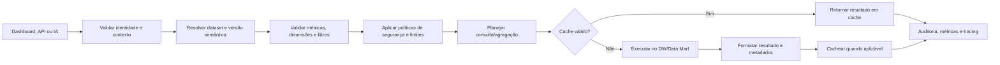

# 10 - Analytics Engine

**Projeto:** Enterprise Intelligence Platform (EIP)  
**Versão:** 1.0  
**Status:** Oficial  
**Última atualização:** Julho/2026

---

# 1. Objetivo

O Analytics Engine executa consultas analíticas governadas para dashboards, relatórios, APIs e recursos de IA. Ele transforma uma intenção estruturada — métricas, dimensões, filtros, período e ordenação — em consultas seguras sobre a camada semântica e o Data Warehouse.

O motor não acessa diretamente ERPs, Data Lake bruto ou tabelas de conectores. Também não aceita SQL arbitrário enviado por usuários ou pelo frontend.

```text
Dashboard / Relatório / IA → Analytics Engine → Camada Semântica → Data Warehouse
```

---

# 2. Responsabilidades e Limites

| Analytics Engine faz | Analytics Engine não faz |
|---|---|
| valida métricas, dimensões, filtros e escopo | criar ou alterar dados transacionais |
| aplica permissões e contexto de tenant/workspace | consultar fontes externas diretamente |
| planeja e executa consultas analíticas | permitir SQL/expressões livres do usuário |
| usa cache e agregações aprovadas | definir sozinho a semântica das métricas |
| devolve resultado, frescor e metadados | renderizar gráficos ou telas |
| registra custo, desempenho e auditoria | ocultar falhas de qualidade dos dados |

As definições de métrica pertencem à Camada Semântica; o Dashboard Engine decide apresentação; o Analytics Engine aplica ambos de forma segura e eficiente.

---

# 3. Princípios

- **Semântica antes de SQL:** toda consulta usa entidades, métricas e dimensões catalogadas.
- **Segurança antes de conveniência:** tenant, workspace, empresa e permissões são aplicados antes da execução.
- **Consulta declarativa:** consumidores descrevem o que desejam, não como consultar.
- **Métricas únicas:** mesma métrica tem definição, versão e cálculo consistentes em toda a plataforma.
- **Custo controlado:** limites de cardinalidade, tempo, volume e concorrência evitam consultas destrutivas.
- **Resultado explicável:** respostas incluem definição, período, filtros, frescor e avisos relevantes.
- **Cache seguro:** cache é por escopo autorizado, versão e parâmetros normalizados.
- **Evolução compatível:** mudanças semânticas são versionadas e não alteram resultados silenciosamente.

---

# 4. Catálogo Analítico

O Analytics Engine consulta o catálogo/semantic layer para conhecer conjuntos de dados, medidas, dimensões e políticas autorizadas.

## 4.1 Dataset analítico

Um dataset representa uma área consultável, como `sales`, `finance` ou `inventory`.

| Atributo | Descrição |
|---|---|
| `Id` e `Version` | identificador e versão do contrato |
| `Name` e `Description` | nome técnico e explicação de negócio |
| `Owner` | responsável técnico e de negócio |
| `Metrics` | medidas disponíveis e suas fórmulas certificadas |
| `Dimensions` | atributos permitidos para agrupar/filtrar |
| `Relationships` | junções autorizadas e cardinalidade |
| `DefaultTimeDimension` | dimensão temporal principal |
| `FreshnessPolicy` | expectativa de atualização e SLA |
| `SecurityPolicy` | filtros obrigatórios e classificação de dados |

## 4.2 Métricas

Cada métrica possui nome técnico estável, rótulo, fórmula, agregação, formato, granularidade compatível, proprietário e versão.

Exemplos iniciais:

| Dataset | Métrica | Definição resumida |
|---|---|---|
| Sales | `netRevenue` | soma do valor líquido de itens de faturas válidas |
| Sales | `invoicedQuantity` | soma da quantidade faturada válida |
| Sales | `averageTicket` | receita líquida / contagem distinta de faturas válidas |
| Finance | `openReceivables` | saldo aberto de títulos de recebimento em aberto |
| Finance | `overdueReceivables` | saldo aberto de títulos com vencimento anterior à referência |
| Inventory | `availableInventory` | saldo disponível no último snapshot permitido |

Uma métrica só é publicada após definição, exemplo, teste de reconciliação e aprovação de proprietário de negócio.

---

# 5. Contrato Declarativo de Consulta

## 5.1 Estrutura

O consumidor envia uma consulta estruturada, validada contra o catálogo:

```json
{
  "dataset": "sales",
  "metrics": ["netRevenue", "invoicedQuantity"],
  "dimensions": ["date.month", "product.category"],
  "filters": [
    {
      "field": "date",
      "operator": "between",
      "values": ["2026-01-01", "2026-06-30"]
    },
    {
      "field": "company.id",
      "operator": "in",
      "values": ["1db635af-56d8-48ef-b421-b834e8d34fb5"]
    }
  ],
  "orderBy": [{ "field": "netRevenue", "direction": "desc" }],
  "limit": 100
}
```

O contexto de tenant e workspace não é opcional do ponto de vista do servidor; ele é derivado da identidade, e não deve ser confiado apenas no payload.

## 5.2 Operadores permitidos

Operadores são definidos por tipo de campo:

| Tipo | Operadores típicos |
|---|---|
| Texto/código | `equals`, `in`, `contains`, `startsWith` quando indexado e permitido |
| Número/moeda | `equals`, `in`, `greaterThan`, `greaterOrEqual`, `lessThan`, `between` |
| Data | `equals`, `before`, `after`, `between`, períodos relativos catalogados |
| Booleano/status | `equals`, `in` |

Campos, operadores, valores máximos e combinações são validados. Não são suportados SQL, scripts, nomes físicos de coluna, funções livres ou expressões arbitrárias.

## 5.3 Resposta

```json
{
  "data": [
    {
      "date.month": "2026-06",
      "product.category": "Bebidas",
      "netRevenue": 284500.75,
      "invoicedQuantity": 1260
    }
  ],
  "metadata": {
    "dataset": "sales",
    "semanticVersion": "1.0",
    "executedAt": "2026-07-22T16:00:00Z",
    "dataFreshnessAt": "2026-07-22T15:35:00Z",
    "appliedFilters": 2,
    "rowCount": 1,
    "isPartial": false
  },
  "warnings": []
}
```

Respostas incluem somente dados permitidos e metadados suficientes para interpretação. Avisos podem indicar frescor vencido, dados parcialmente indisponíveis, limites aplicados ou qualidade reduzida.

---

# 6. Fluxo de Execução



## 6.1 Validação e políticas

Antes de gerar consulta, o motor verifica:

- tenant, workspace, empresa e permissão de acesso ao dataset;
- métricas/dimensões publicadas na versão solicitada;
- compatibilidade de granularidade e relações;
- filtros obrigatórios de segurança/classificação;
- intervalo temporal, cardinalidade estimada, limite de linhas e custo;
- quota do tenant, usuário e rota;
- frescor e disponibilidade do dataset.

## 6.2 Planejamento

O planner seleciona a fonte mais adequada: fato detalhado, data mart ou agregação materializada. A decisão é transparente para o consumidor e não pode alterar a semântica da métrica.

O motor usa queries parametrizadas e junções pré-aprovadas. Todo acesso ao DW ocorre com credencial de serviço de menor privilégio.

---

# 7. Segurança e Isolamento

## 7.1 Filtros obrigatórios

Filtros de tenant e escopos autorizados são acrescentados pelo servidor e não podem ser removidos ou neutralizados pelo consumidor. A consulta deve restringir empresas, filiais, workspaces e classificação conforme a política do dataset.

Um filtro solicitado pelo usuário somente reduz o escopo já autorizado; ele nunca amplia visibilidade.

## 7.2 Dados sensíveis

Datasets e campos possuem classificação. O motor pode omitir, mascarar, agregar ou bloquear campos conforme permissão, finalidade e política de exportação. Dados detalhados de pessoas ou finanças exigem escopo explícito e auditoria reforçada.

## 7.3 IA

Consultas geradas a partir de linguagem natural são convertidas para o mesmo contrato declarativo e passam pelas mesmas validações. A IA não recebe acesso especial a SQL, datasets ou dados de outro tenant.

---

# 8. Desempenho, Cache e Limites

## 8.1 Cache

Resultados podem ser cacheados no Redis quando forem determinísticos e seguros. A chave inclui:

```text
tenant + workspace + permissionScope + semanticVersion + normalizedQuery + dataVersion
```

O cache é invalidado por atualização relevante do Warehouse, nova versão de métrica, mudança de permissão ou expiração de TTL. Resultados sem escopo consistente, com dados altamente sensíveis ou consulta muito específica podem não usar cache.

## 8.2 Guardrails

O motor define limites configuráveis por plano e endpoint:

- intervalo máximo de datas e número de dimensões;
- número máximo de membros retornados por dimensão;
- tamanho de `IN`, exportação e resposta;
- tempo máximo de execução e concorrência;
- complexidade de joins/filtros;
- quota de consultas por usuário, tenant e período.

Ao exceder limite, a API retorna erro claro ou propõe operação assíncrona/exportação autorizada. Não reduz resultados silenciosamente, exceto quando o contrato declarar explicitamente que a resposta é parcial.

## 8.3 Consultas longas

Consultas que excedem o orçamento síncrono são canceladas ou entregues como job de exportação/relatório. Jobs preservam contexto, permissão de origem, expiração do resultado e trilha de auditoria.

---

# 9. Time Intelligence

Comparações temporais são baseadas em `DimDate` e regras semânticas explícitas, incluindo calendário fiscal quando configurado por empresa/tenant.

Operações iniciais permitidas:

- período atual, anterior e intervalo customizado;
- acumulado no mês, trimestre e ano;
- comparação mês contra mês e ano contra ano;
- média móvel quando a métrica suportar;
- data de referência explícita para contas em aberto e estoque.

O motor não presume que calendário fiscal, fuso ou data de corte são iguais para todos os tenants.

---

# 10. Análises Avançadas

Recursos como tendência, previsão, contribuição, detecção de anomalia e decomposição podem ser adicionados como capacidades do Analytics Engine, desde que tenham:

- definição de entrada e saída versionada;
- limites de dados e custo;
- explicação do método e nível de confiança;
- validação de qualidade/frescor;
- autorização equivalente aos dados de origem;
- monitoramento de desempenho e precisão;
- revisão humana antes de automações de alto impacto.

Esses recursos não integram o escopo obrigatório do MVP.

---

# 11. Observabilidade e Auditoria

Cada consulta registra, sem expor dados sensíveis em logs:

- dataset, métricas, dimensões e versão semântica;
- tenant/workspace de forma segura e identidade solicitante;
- filtros normalizados ou hash de consulta;
- fonte selecionada, cache hit/miss, duração e volume retornado;
- custo estimado/real, limite ou quota aplicada;
- frescor, avisos, status e `CorrelationId`.

Métricas operacionais incluem latência p50/p95/p99, cache hit rate, erros, cancelamentos, consultas custosas, uso por tenant/plano e atraso dos datasets.

---

# 12. APIs Iniciais

| Endpoint | Finalidade |
|---|---|
| `GET /api/v1/analytics/datasets` | listar datasets visíveis ao contexto autenticado |
| `GET /api/v1/analytics/datasets/{id}` | obter metadados, métricas e dimensões autorizadas |
| `POST /api/v1/analytics/query` | executar consulta declarativa síncrona dentro dos limites |
| `POST /api/v1/analytics/exports` | solicitar exportação assíncrona autorizada |
| `GET /api/v1/analytics/exports/{id}` | consultar status e resultado temporário de exportação |

O endpoint de query não aceita SQL, MDX, scripts ou URLs de fontes externas.

---

# 13. Critérios de Prontidão de Dataset

Um dataset só pode ser publicado no Analytics Engine quando:

- fatos, dimensões, grão e relações estiverem documentados;
- métricas forem certificadas, versionadas e reconciliadas;
- filtros de tenant, empresa, workspace e classificação forem testados;
- limites de consultas, índices/agregações e desempenho forem medidos;
- frescor, qualidade, proprietário e política de cache forem definidos;
- erros, auditoria, telemetria e exportação forem testados;
- exemplos de consulta estiverem disponíveis na documentação.

---

# 14. Fora do Escopo Inicial

Não fazem parte da primeira versão:

- editor livre de SQL para usuários finais;
- joins e fórmulas arbitrárias criadas no navegador;
- streaming de consultas em tempo real para todos os datasets;
- previsão/anomalia automática sem dados e validação suficientes;
- acesso semântico entre tenants;
- substituição da camada semântica por configurações individuais de gráficos.

Evoluções são introduzidas com contratos, controles de custo, segurança e ADR quando alterarem a arquitetura.
