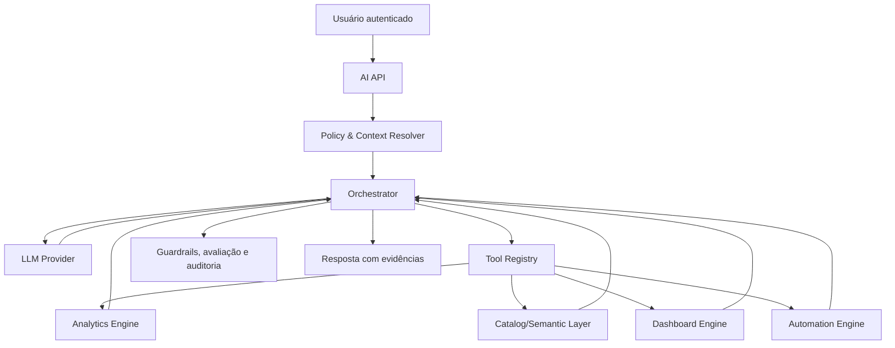
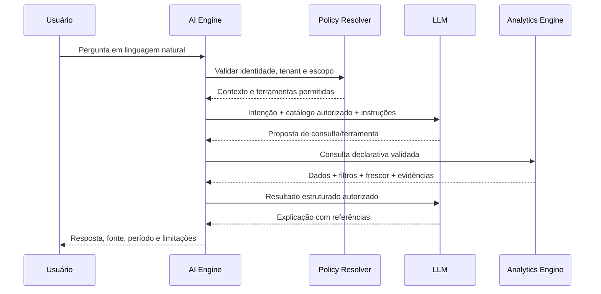

# 11 - AI Engine

**Projeto:** Enterprise Intelligence Platform (EIP)  
**Versão:** 1.0  
**Status:** Oficial  
**Última atualização:** Julho/2026

---

# 1. Objetivo

O AI Engine habilita experiências assistidas por inteligência artificial sobre dados e capacidades da EIP, como perguntas em linguagem natural, explicações de indicadores, geração assistida de consultas e recomendações.

Ele não é uma rota direta para o banco de dados, não substitui regras de autorização e não pode executar ações empresariais por conta própria sem ferramenta, escopo e aprovação explicitamente definidos.

```text
Usuário → AI Engine → Política e contexto → Ferramentas autorizadas → Analytics / Dashboard / Automação
```

---

# 2. Princípios

- **IA sob as mesmas permissões do usuário:** o modelo só vê e consulta o que o solicitante pode acessar.
- **Ferramentas explícitas:** nenhuma ação ocorre fora de uma ferramenta registrada, limitada e auditada.
- **Dados mínimos:** contexto enviado ao modelo é reduzido ao necessário para a tarefa.
- **Resposta verificável:** números e afirmações factuais devem indicar origem, período, filtros e frescor.
- **Humano no controle:** ações com impacto externo, financeiro, administrativo ou irreversível exigem confirmação humana.
- **Segurança contra instruções maliciosas:** dados e prompts de usuário não podem alterar políticas, permissões ou instruções de sistema.
- **Observabilidade e avaliação:** uso, custo, qualidade, falhas e riscos são monitorados continuamente.
- **Degradação segura:** indisponibilidade de IA não interrompe dashboards, conectores ou funções essenciais da plataforma.

---

# 3. Casos de Uso

## 3.1 MVP

| Capacidade | Exemplo | Limite inicial |
|---|---|---|
| Pergunta analítica | “Qual foi a receita líquida por mês?” | converte intenção em consulta declarativa do Analytics Engine |
| Explicação de indicador | “Por que a receita caiu?” | usa métricas e decomposições aprovadas; apresenta evidências |
| Descoberta de dados | “Quais indicadores de vendas estão disponíveis?” | consulta catálogo semântico visível ao usuário |
| Geração assistida de dashboard | “Crie um painel de vendas mensal” | propõe especificação; publicação exige revisão do usuário |
| Resumo executivo | “Resuma os principais resultados da semana” | usa dados autorizados e declara período/frescor |

## 3.2 Evolução posterior

- previsões e detecção de anomalias validadas;
- agentes especializados por domínio;
- recomendações e automações com aprovação;
- enriquecimento com documentos e base de conhecimento;
- geração assistida de mapeamentos de conectores;
- suporte multilíngue e personalização avançada.

Essas capacidades exigem avaliação, controle de custo e ADR quando alterarem a fronteira de segurança ou autonomia.

---

# 4. Arquitetura



## 4.1 Componentes

| Componente | Responsabilidade |
|---|---|
| AI API | recebe solicitação, sessão e preferências de apresentação |
| Policy & Context Resolver | valida identidade, tenant, workspace, permissões, classificação e limites |
| Orchestrator | gerencia prompt, seleção de modelo, ferramentas, tentativas e resposta final |
| Tool Registry | declara ferramentas, schemas, scopes, custos e necessidade de confirmação |
| LLM Provider Adapter | abstrai modelos/provedores e aplica políticas de dados/custo |
| Knowledge/Retrieval Layer | recupera documentação e metadados permitidos quando aplicável |
| Evaluation & Guardrails | detecta falhas, injection, resposta inadequada e mede qualidade |
| Audit/Telemetry | registra uso, decisão, ferramentas, custo e correlação |

O orquestrador não recebe acesso direto ao Data Warehouse. Dados são obtidos exclusivamente pelas ferramentas aprovadas.

---

# 5. Contexto e Autorização

Antes de chamar um modelo ou ferramenta, o AI Engine resolve:

```text
Identidade + Tenant + Workspace + Empresas permitidas + Permissões + Classificação + Quota
```

## 5.1 Regra de equivalência

Uma pergunta feita pela IA precisa retornar exatamente o mesmo conjunto de dados que seria permitido àquele usuário em uma consulta normal do Analytics Engine. Não existe papel implícito de “assistente” com acesso ampliado.

## 5.2 Contexto mínimo

O prompt recebe somente o que é necessário: intenção do usuário, idioma, metadados semânticos autorizados, resultado agregado de ferramentas e instruções de apresentação. Não enviar tabelas completas, dados brutos, credenciais, tokens, logs internos ou informações de outro tenant.

## 5.3 Memória e sessões

Memória conversacional é isolada por usuário, tenant e workspace. Ela possui retenção configurável, pode ser desativada pelo tenant e não é usada para treinar modelos sem autorização explícita e base legal aplicável.

Trocar de tenant ou workspace encerra/segmenta o contexto da conversa; informações do contexto anterior não podem ser reaproveitadas automaticamente.

---

# 6. Ferramentas Autorizadas

Cada ferramenta possui schema de entrada/saída, permissão, escopo, política de custo, timeout, idempotência e classificação de risco.

| Ferramenta | Finalidade | Risco | Confirmação |
|---|---|---:|---|
| `listDatasets` | listar datasets e métricas visíveis | baixo | não |
| `queryAnalytics` | executar consulta declarativa governada | médio | não, dentro de quota |
| `getMetricDefinition` | explicar métrica e linhagem | baixo | não |
| `draftDashboard` | gerar especificação não publicada | baixo | não |
| `publishDashboard` | publicar dashboard | médio | sim |
| `createAutomationDraft` | criar rascunho de automação | médio | não |
| `activateAutomation` | ativar automação | alto | sim, com política adicional |
| `requestExport` | gerar exportação de dados | alto | sim quando dados/classificação exigirem |

Ferramentas não registradas são indisponíveis ao modelo. A descrição da ferramenta deve limitar claramente suas capacidades; não usar uma ferramenta genérica que execute comandos, SQL ou HTTP arbitrários.

---

# 7. Fluxo de Pergunta Analítica



O modelo propõe; a plataforma valida e executa. Se a consulta não puder ser construída com segurança, a IA pede esclarecimento ou informa a limitação — nunca inventa números.

---

# 8. Respostas, Evidências e Incerteza

Respostas analíticas devem informar, quando aplicável:

- métrica/dataset utilizado;
- período e filtros aplicados;
- empresas/workspace no escopo, sem expor elementos não autorizados;
- data/hora de atualização dos dados;
- origem da afirmação: resultado de consulta, documento recuperado ou inferência;
- limitações de qualidade, amostra, frescor ou cobertura;
- nível de confiança somente quando houver método definido para calculá-lo.

Exemplo de estrutura interna de evidência:

```json
{
  "statement": "A receita líquida caiu 8,2% em junho em relação a maio.",
  "evidence": {
    "dataset": "sales",
    "metric": "netRevenue",
    "period": "2026-06-01/2026-06-30",
    "comparisonPeriod": "2026-05-01/2026-05-31",
    "dataFreshnessAt": "2026-07-01T02:00:00Z"
  }
}
```

O usuário recebe uma apresentação legível; a estrutura permite auditoria e reprodução da resposta.

---

# 9. Segurança de IA

## 9.1 Prompt injection e conteúdo não confiável

Entradas de usuário, documentos recuperados, nomes de campos e dados de ERP são conteúdo não confiável. Eles não podem instruir o sistema a ignorar políticas, revelar segredos, chamar ferramentas fora do escopo ou alterar a ordem de segurança.

Controles:

- instruções de sistema separadas de conteúdo de usuário/dados;
- schemas rígidos para chamadas de ferramenta;
- allowlist de ferramentas e parâmetros;
- validação no servidor, independente do texto produzido pelo modelo;
- bloqueio/alerta para tentativa de exfiltração, bypass ou ação indevida;
- limites de tamanho de contexto, profundidade de cadeia e número de chamadas.

## 9.2 Dados e provedores

Antes de usar um provedor de LLM, definir contrato de processamento, retenção, localização, política de não treinamento e controles de segurança adequados. A seleção do modelo deve considerar classificação do dado, custo, disponibilidade e requisitos contratuais.

Dados altamente sensíveis não são enviados a provedores externos sem avaliação de risco e autorização aplicável. Quando possível, enviar agregados, pseudonimizados ou minimizados.

## 9.3 Ações e automação

O AI Engine não executa mudanças externas por texto. Ações exigem ferramenta específica, validação de parâmetros, política de autorização e confirmação do usuário para riscos médios/altos. A confirmação mostra o efeito pretendido, escopo e dados envolvidos.

---

# 10. Privacidade e LGPD

- conversas, prompts e resultados são classificados conforme o conteúdo;
- retenção é configurável por tenant e finalidade;
- logs armazenam metadados mínimos; conteúdo completo só é retido quando necessário e autorizado;
- usuários/tenants podem solicitar exclusão de histórico conforme política e obrigação legal;
- dados usados em avaliação são anonimizados ou sintéticos quando possível;
- nenhum dado de cliente é usado para treinamento geral sem autorização explícita, base legal e controles contratuais;
- acesso humano de suporte a conversas/dados exige permissão, justificativa e auditoria.

---

# 11. Qualidade, Avaliação e Segurança Operacional

## 11.1 Avaliação

Cada capacidade de IA deve possuir conjunto de casos de teste versionado, com perguntas esperadas, permissões diferentes, dados incompletos, ambiguidade e tentativas de prompt injection.

Métricas iniciais:

- taxa de respostas com evidência válida;
- precisão da seleção de métrica/filtro em casos avaliados;
- taxa de alucinação e recusa correta;
- sucesso/falha de ferramenta;
- latência, número de chamadas e custo por solicitação;
- incidentes de segurança, conteúdo inadequado e feedback do usuário.

## 11.2 Guardrails de saída

Antes da apresentação, validar estrutura da resposta, referências, linguagem inadequada, números sem evidência e tentativa de revelar instruções/segredos. Uma resposta pode ser bloqueada, reduzida a informação segura ou encaminhada para nova geração com contexto restrito.

## 11.3 Fallback

Se o provedor ou uma ferramenta falhar, a resposta informa indisponibilidade parcial e sugere o caminho normal da plataforma. Dashboards e APIs analíticas permanecem operacionais independentemente da IA.

---

# 12. Custo, Quotas e Modelos

O AI Engine controla consumo por tenant, usuário, plano, capacidade e tipo de modelo. Cada solicitação registra tokens/unidades, chamadas de ferramenta, duração e custo estimado/real.

Políticas incluem:

- quota mensal e limites de taxa/concurrency;
- modelo compatível com risco e complexidade da tarefa;
- orçamento máximo por solicitação e por fluxo de agente;
- redução de contexto e cache de respostas somente quando seguro;
- bloqueio ou aprovação para tarefas acima de limite;
- alertas de consumo anormal.

O cache de IA não pode servir resposta entre tenants ou ignorar escopo/versão de dados.

---

# 13. Observabilidade e Auditoria

Para cada interação, registrar de modo seguro:

- identidade solicitante, tenant, workspace e permissões efetivas;
- capacidade solicitada, modelo/provedor e versões de prompt/ferramenta;
- ferramentas chamadas, parâmetros normalizados/hashes e resultados de status;
- datasets, métricas, período e frescor usados como evidência;
- decisão de confirmação, ação tomada ou recusada;
- latência, custo, tokens/unidades, falhas e `CorrelationId`.

Logs não devem incluir segredos, token, dados brutos completos ou conteúdo sensível além da política de retenção. Ações geradas/confirmadas pela IA recebem evento de auditoria próprio.

---

# 14. APIs Iniciais

| Endpoint | Finalidade |
|---|---|
| `POST /api/v1/ai/conversations` | criar conversa no contexto autorizado |
| `POST /api/v1/ai/conversations/{id}/messages` | enviar pergunta e obter resposta assistida |
| `GET /api/v1/ai/conversations/{id}` | consultar histórico permitido |
| `POST /api/v1/ai/actions/{id}/confirm` | confirmar ação pendente autorizada |
| `DELETE /api/v1/ai/conversations/{id}` | solicitar exclusão conforme política de retenção |

O contrato de resposta deve trazer conteúdo, evidências estruturadas, avisos, frescor e ações pendentes de confirmação. Não expõe prompt de sistema, cadeia interna de raciocínio ou detalhes protegidos do provedor.

---

# 15. Critérios de Prontidão para Nova Capacidade de IA

- caso de uso, usuário, benefício e risco definidos;
- permissões, datasets/ferramentas e escopos revisados;
- política de dados, retenção e provedor aprovada;
- schemas e validações de ferramenta implementados;
- confirmação humana definida para ações de impacto;
- casos de avaliação, injection e falha testados;
- custo, quota, telemetria e alertas configurados;
- resposta com evidências e limitações validada;
- plano de fallback e responsável operacional definidos.

---

# 16. Fora do Escopo Inicial

Não fazem parte do MVP:

- agente com acesso administrativo amplo ou execução autônoma;
- treinamento de modelo com dados de clientes;
- geração de SQL livre e execução direta no DW;
- recomendação/decisão automática de crédito, preço, contratação ou outra decisão de alto impacto;
- voz, imagem, vídeo ou processamento multimodal corporativo;
- memória ilimitada ou compartilhada entre tenants/usuários.

Essas capacidades somente podem ser introduzidas com avaliação de segurança, privacidade, custo, impacto de negócio e ADR.
