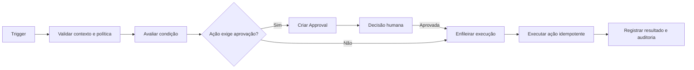

# 13 - Automação

**Projeto:** Enterprise Intelligence Platform (EIP)  
**Versão:** 1.0  
**Status:** Oficial  
**Última atualização:** Julho/2026

---

# 1. Objetivo

O Automation Engine permite criar fluxos governados que reagem a eventos, agenda ou condições analíticas. Ele transforma uma regra explícita em execução rastreável, sem permitir que automações ultrapassem as permissões, os dados ou os limites definidos pelo tenant.

O foco inicial é informar e coordenar. Alterações em sistemas externos ou ações de impacto entram somente mediante conectores, permissões, confirmação e controles adicionais.

```text
Evento / Agenda / Condição → Regra → Avaliação → Ação autorizada → Auditoria
```

---

# 2. Princípios

- automações são declarativas, versionadas e auditáveis;
- gatilhos e condições usam eventos e métricas governadas;
- ações seguem menor privilégio e contexto de tenant/workspace/empresa;
- execução é assíncrona, idempotente e recuperável;
- efeitos externos exigem política explícita e, quando necessário, aprovação humana;
- uma falha não pode gerar duplicidade silenciosa ou bloquear serviços essenciais;
- usuários sempre podem identificar quem criou, ativou, alterou e executou uma regra.

---

# 3. Modelo de Domínio

| Entidade | Descrição |
|---|---|
| Automation | regra de negócio com proprietário, escopo, estado e versão ativa |
| Trigger | origem de disparo: evento, agenda ou condição analítica |
| Condition | critérios avaliados antes da ação |
| Action | efeito permitido: notificar, gerar relatório, criar rascunho ou chamar integração aprovada |
| Execution | tentativa de execução com status, dados mínimos, correlação e resultado |
| Approval | confirmação humana pendente para ação controlada |
| Policy | limites de frequência, custo, risco e permissões |

Toda automação pertence a um tenant e, quando aplicável, a um workspace e empresas autorizadas.

---

# 4. Ciclo de Vida

```text
Draft → Validating → Active ↔ Paused → Archived
                     ↘ Error
```

- **Draft:** editável e sem execução.
- **Validating:** valida gatilho, dados, permissões, limites e ações.
- **Active:** pode ser disparada.
- **Paused:** preserva configuração, mas bloqueia novas execuções.
- **Error:** falhas recorrentes ou configuração inválida exigem atenção.
- **Archived:** mantém histórico, sem uso operacional.

Ativar, pausar, alterar, testar ou arquivar exige permissão específica e auditoria. Alterar uma automação ativa cria nova versão; a versão anterior permanece rastreável.

---

# 5. Gatilhos

## 5.1 Eventos

Eventos internos confiáveis podem iniciar fluxos, por exemplo:

- `connector.sync-job.succeeded`;
- `canonical.quality-check.failed`;
- `warehouse.load.completed`;
- `dashboard.threshold.exceeded`;
- `financial.title.overdue`;
- `automation.approval.completed`.

O trigger recebe envelope versionado, valida tenant e deduplica pelo `eventId`. Eventos não autorizam ações por si só; a regra e condições ainda são avaliadas.

## 5.2 Agenda

Agendamentos usam fuso horário explícito do tenant e expressões controladas. Exemplos: diário às 08h, toda segunda-feira ou no primeiro dia útil do mês. A plataforma registra próxima execução, últimas execuções e falhas de agenda.

## 5.3 Condição analítica

Uma condição pode consultar métricas certificadas pelo Analytics Engine, por exemplo: “contas vencidas acima de R$ 50.000” ou “queda mensal de receita maior que 10%”. A consulta é declarativa, limitada por custo e vinculada a um período/frescor explícitos.

Não são permitidos SQL, scripts ou fórmulas arbitrárias inseridas pelo usuário.

---

# 6. Condições e Proteções contra Ruído

Condições podem combinar comparações, estado anterior, janela temporal e escopo de empresa, sempre por operadores aprovados. Para evitar alertas repetitivos, uma regra pode ter:

- cooldown entre execuções;
- deduplicação por chave de negócio;
- limite de frequência por período;
- tolerância/histerese para limiares;
- janela de agregação;
- exigência de N ocorrências consecutivas;
- supressão em janela de manutenção.

O mecanismo registra por que uma condição foi atendida, ignorada ou suprimida. Uma automação não pode ser configurada para se disparar infinitamente por eventos que ela própria produz.

---

# 7. Ações

| Ação inicial | Descrição | Risco |
|---|---|---:|
| Notificar | enviar alerta por canal configurado | baixo/médio |
| Criar relatório/exportação | gerar artefato assíncrono com permissão de origem | médio |
| Criar tarefa interna | registrar tarefa para usuário/grupo autorizado | médio |
| Criar rascunho | preparar dashboard, e-mail ou automação para revisão | baixo |
| Chamar webhook aprovado | notificar endpoint cadastrado e assinado | médio/alto |

No MVP, ações não devem gravar em ERP, alterar cadastros financeiros, enviar mensagem em massa ou tomar decisão de alto impacto sem aprovação específica.

Cada ação define schema, timeout, retry, idempotência, classificação de dados e requisito de confirmação. O executor usa identidade de serviço limitada e nunca as credenciais pessoais do criador.

---

# 8. Aprovação Humana

Aprovação é obrigatória para ações com impacto externo, dados confidenciais, alta escala, custo elevado ou risco financeiro/administrativo.

O pedido de aprovação informa: automação, condição que a originou, ação proposta, escopo, dados resumidos, destinatário/integração, prazo e autor. O aprovador precisa ter permissão no mesmo tenant/escopo.

Estados: `pending`, `approved`, `rejected`, `expired`, `canceled`. Aprovação não pode ser reutilizada fora do contexto e expira. Toda decisão é auditada.

---

# 9. Execução Confiável



Execuções usam filas, correlação, retry exponencial para falhas transitórias e DLQ após limite. A chave de idempotência combina automação, versão, trigger e chave de negócio. Falhas permanentes — permissão removida, destino inválido, política bloqueada — não devem ser repetidas automaticamente.

---

# 10. Segurança e Privacidade

- tenant, workspace, empresa e permissões são validados no trigger, na avaliação e na ação;
- automações não ampliam o acesso do criador ou destinatário aos dados;
- payloads carregam apenas dados necessários e seguem classificação/mascaramento;
- webhooks têm URL aprovada, assinatura, timeout, retry e proteção contra SSRF;
- segredos de integrações ficam em secret manager;
- ações e exportações respeitam política de retenção, link temporário e auditoria;
- alterações de regras, aprovação e execução são auditadas;
- automações criadas por IA permanecem rascunhos até revisão/ativação humana.

---

# 11. Observabilidade e Operação

Cada execução registra trigger, condições avaliadas, versão, identidade, escopo, ação, tentativa, duração, resultado, erro seguro, custo e `CorrelationId`.

Métricas: execuções por status, taxa de sucesso, retries, DLQ, aprovações pendentes, ações suprimidas, latência, volume por tenant e risco de loops. Alertar para falhas recorrentes, atraso de agenda, automação em erro, backlog e consumo anormal.

Usuários autorizados podem consultar histórico, pausar regra, reexecutar quando seguro e investigar resultado sem visualizar dados fora de seu escopo.

---

# 12. APIs Iniciais

| Endpoint | Finalidade |
|---|---|
| `GET/POST /api/v1/automations` | listar/criar rascunhos |
| `GET/PATCH /api/v1/automations/{id}` | consultar/editar versão atual |
| `POST /api/v1/automations/{id}/validate` | validar gatilho, condições e ações |
| `POST /api/v1/automations/{id}/activate` | ativar versão aprovada |
| `POST /api/v1/automations/{id}/pause` | pausar execução |
| `GET /api/v1/automations/{id}/executions` | consultar histórico |
| `POST /api/v1/automation-approvals/{id}/decision` | aprovar ou rejeitar ação pendente |

Operações longas ou reexecuções seguem o padrão de job definido no API Design.

---

# 13. Critérios de Prontidão

Uma automação só pode ser ativada quando:

- proprietário, tenant, workspace e empresas no escopo estiverem definidos;
- gatilho e condições usarem contratos/datasets publicados;
- ação possuir schema, permissão, risco, idempotência e política de retry;
- limites de frequência, cooldown e prevenção de loop estiverem configurados;
- aprovação humana estiver configurada quando exigida;
- dados classificados e destinatários forem autorizados;
- testes de sucesso, falha, duplicidade, permissão e reprocessamento forem aprovados;
- auditoria, alertas e responsável operacional estiverem definidos.

---

# 14. Fora do Escopo Inicial

Não fazem parte do MVP:

- editor de código/script executável pelo usuário;
- automações autônomas de IA com privilégios amplos;
- escrita direta em ERP ou sistemas financeiros;
- orquestração BPMN completa;
- disparos ilimitados ou envio em massa sem quotas;
- compartilhamento de automações entre tenants.

Novas ações ou conectores de saída exigem avaliação de risco, contratos e ADR quando alterarem a arquitetura.
